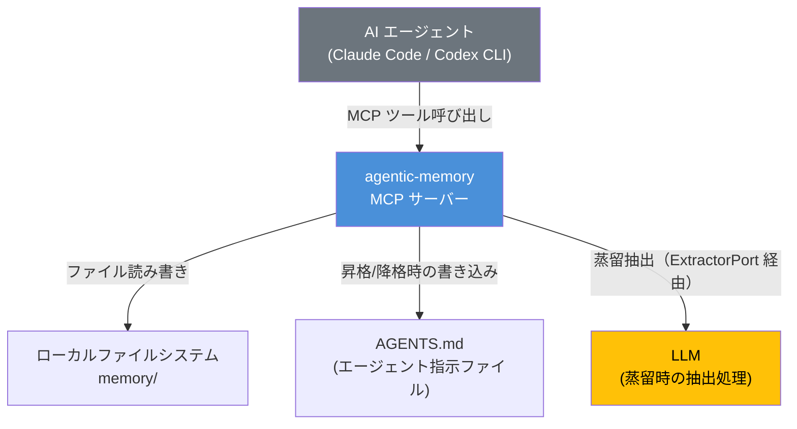
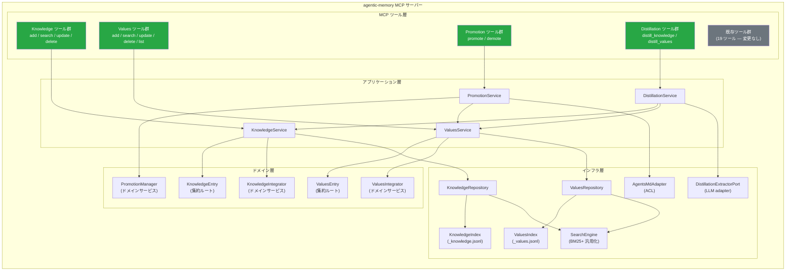
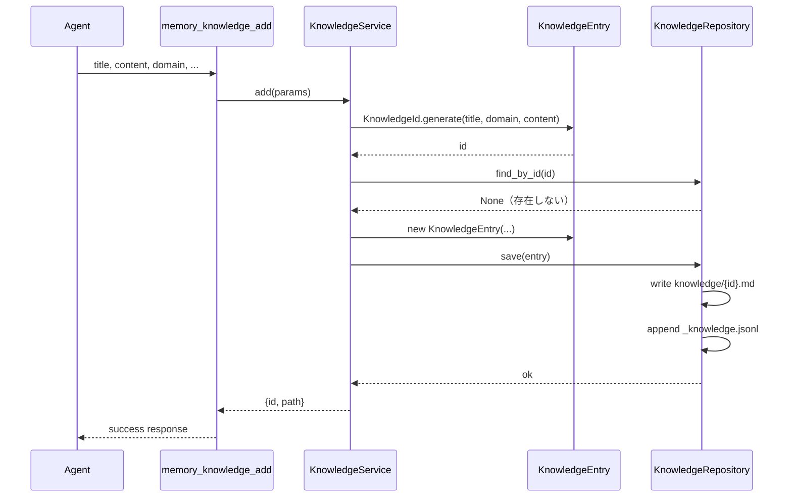
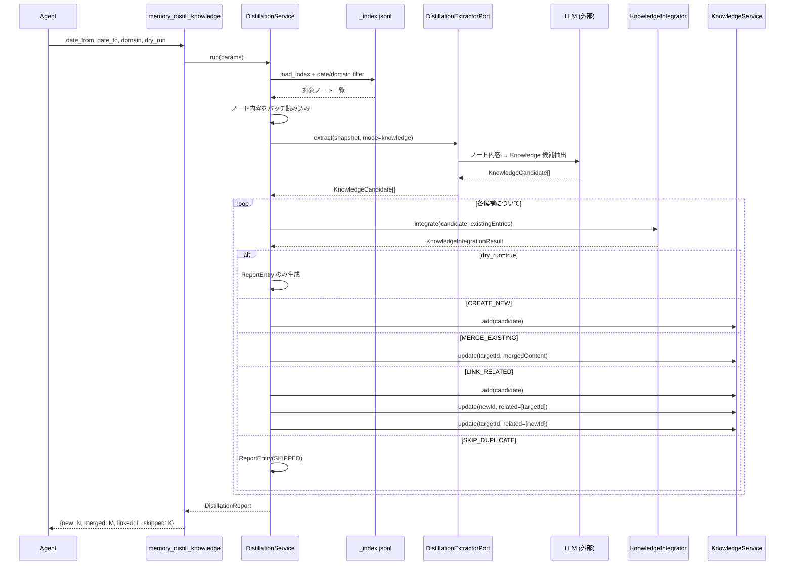
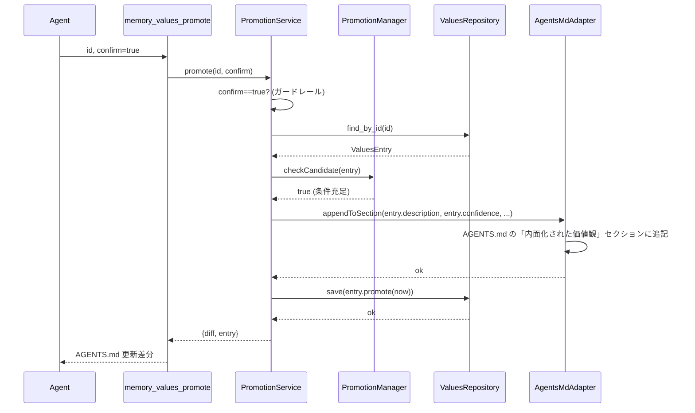
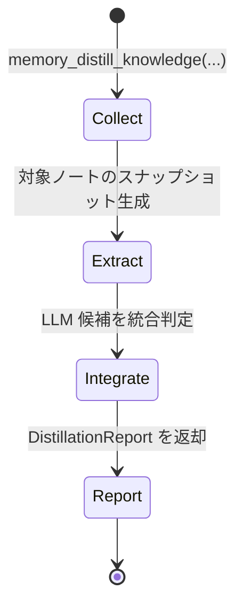

# アーキテクチャ設計: Knowledge & Values 拡張

| 項目 | 内容 |
|---|---|
| バージョン | 0.1.0（ドラフト） |
| 最終更新日 | 2026-04-08 |
| 関連要件 | [REQ-knowledge-values.md](../requirements/REQ-knowledge-values.md) |
| 関連ドメインモデル | [DOMAIN-MODEL-knowledge-values.md](DOMAIN-MODEL-knowledge-values.md) |

---

## 1. 品質特性と優先順位

| 優先度 | 品質特性 | 根拠 |
|---|---|---|
| 1 | **後方互換性** | 既存 19 MCP ツール・270+ テストケースを破壊しないこと（REQ-NF-003）。最優先の制約 |
| 2 | **保守性** | 既存 `core/` のフラットモジュール構造に Knowledge/Values/蒸留の3コンテキストを追加するため、モジュール境界の明確化が不可欠 |
| 3 | **拡張性** | 将来的な push 型配信・横断検索・降格メカニズム等の Could 要件への対応余地を確保 |
| 4 | **検索性能** | エントリ数 1,000 件以下で p95 500ms 以内（REQ-NF-001）。ベンチマークは CI ランナーまたは開発者ラップトップ相当の環境で計測する。既存 BM25+ エンジンの流用で達成可能 |
| 5 | **運用性** | `memory_init` のみでマイグレーション完了（REQ-NF-005）、health check 統合（REQ-NF-004） |

---

## 2. システムコンテキスト（C4 Level 1）



**システム境界の説明:**

- **agentic-memory MCP サーバー**: Knowledge/Values の CRUD・検索・昇格・蒸留パイプライン全体を担う。蒸留の「抽出」は内部の `DistillationExtractorPort` 経由で LLM に委譲し、トリガー判定・抽出依頼・統合判定・結果永続化をオーケストレーションする
- **AGENTS.md**: Values 昇格時の書き込み先。外部システムとして ACL を介してアクセスする
- **LLM**: 蒸留パイプラインにおける抽出処理を担当。agentic-memory の外部依存として位置づける

---

## 3. コンテナ図（C4 Level 2）



---

## 4. 主要コンポーネントと責務

### 4.1 レイヤード構成

| レイヤー | コンポーネント | 責務 | 依存先 |
|---|---|---|---|
| **MCP ツール層** | `server.py` の新規ツール関数 | パラメータバリデーション、`memory_dir` 解決、アプリケーション層の呼び出し、`ok`/`warnings` エンベロープ形式でのレスポンス整形 | アプリケーション層 |
| **アプリケーション層** | `KnowledgeService` | Knowledge CRUD のオーケストレーション、related の逆引き一括更新（判断記録 2） | ドメイン層、インフラ層 |
| | `ValuesService` | Values CRUD のオーケストレーション、昇格候補通知の組み込み | ドメイン層、インフラ層 |
| | `DistillationService` | 公開ツール契約を維持しつつ、対象ノート選定・抽出依頼・統合永続化をオーケストレーションする | `KnowledgeService`, `ValuesService`, `DistillationExtractorPort` |
| | `PromotionService` | 昇格/降格のワークフロー、`confirm` ガードレール（アプリケーション層で消費）、AGENTS.md 同期、排他制御 | ドメイン層、`AgentsMdAdapter` |
| **ドメイン層** | `KnowledgeEntry` | Knowledge の不変条件の保護（ID 生成、sources マージ等） | なし（自己完結） |
| | `ValuesEntry` | Values の不変条件の保護（confidence 範囲、evidence 保持上限、昇格条件判定） | なし |
| | `KnowledgeIntegrator` | 蒸留候補と既存 Knowledge の重複検出・マージ判定 | なし |
| | `ValuesIntegrator` | 蒸留候補と既存 Values の重複検出・confidence 更新判定 | なし |
| | `PromotionManager` | 昇格条件判定、降格提案判定など純粋なドメインポリシー（`confirm` は受け取らない） | なし |
| **インフラ層** | `KnowledgeRepository` | Knowledge の永続化（Markdown + frontmatter）、インデックス同期 | `SearchEngine` |
| | `ValuesRepository` | Values の永続化、インデックス同期 | `SearchEngine` |
| | `SearchEngine` | BM25+ スコアリングの汎用化（既存 `scorer.py` / `search.py` の拡張） | なし |
| | `DistillationExtractorPort` | 蒸留時の LLM 抽出を外部実行基盤へ委譲するポート。公開 MCP API は変更しない | なし |
| | `AgentsMdAdapter` | AGENTS.md の「内面化された価値観」セクション操作（ACL） | なし |

### 4.2 既存モジュールとの対応

| 新規コンポーネント | 実装場所（提案） | 既存モジュールとの関係 |
|---|---|---|
| `KnowledgeService` | `core/knowledge/service.py` | `note.py` と並列。ファイル作成ユーティリティは `note.py` から流用可 |
| `ValuesService` | `core/values/service.py` | 同上 |
| `DistillationService` | `core/distillation/service.py` | 新規。ノート読み込みに `search.py` の `load_index` を利用 |
| `DistillationExtractorPort` | `core/distillation/extractor.py` | 新規。CLI / API / 将来の provider を差し替える抽出境界 |
| `PromotionService` | `core/values/promotion.py` | `state.py` のセクション操作パターンを参考にする |
| `KnowledgeEntry` | `core/knowledge/model.py` | 新規。`dataclass` ベース |
| `ValuesEntry` | `core/values/model.py` | 新規。`dataclass` ベース |
| `KnowledgeRepository` | `core/knowledge/repository.py` | `index.py` の upsert/load パターンを踏襲 |
| `ValuesRepository` | `core/values/repository.py` | 同上 |
| `SearchEngine`（汎用化） | `core/scorer.py`（拡張） | 既存の `IndexEntry` / `score_entry` を汎用化 |
| `AgentsMdAdapter` | `core/values/agents_md.py` | 新規。Markdown セクション操作 |

### 4.3 ディレクトリ構成（提案）

```
src/agentic_memory/
├── core/
│   ├── knowledge/           # 新規: Knowledge コンテキスト
│   │   ├── __init__.py
│   │   ├── model.py         # KnowledgeEntry, KnowledgeId, Source 等
│   │   ├── service.py       # KnowledgeService
│   │   ├── repository.py    # KnowledgeRepository
│   │   └── integrator.py    # KnowledgeIntegrator
│   ├── values/              # 新規: Values コンテキスト
│   │   ├── __init__.py
│   │   ├── model.py         # ValuesEntry, ValuesId, Confidence 等
│   │   ├── service.py       # ValuesService
│   │   ├── repository.py    # ValuesRepository
│   │   ├── integrator.py    # ValuesIntegrator
│   │   ├── promotion.py     # PromotionService, PromotionManager
│   │   └── agents_md.py     # AgentsMdAdapter (ACL)
│   ├── distillation/        # 新規: 蒸留コンテキスト
│   │   ├── __init__.py
│   │   ├── service.py       # DistillationService
│   │   ├── extractor.py     # DistillationExtractorPort
│   │   └── trigger.py       # DistillationTrigger
│   ├── index.py             # 既存（変更なし）
│   ├── search.py            # 既存（軽微な拡張: 汎用インデックス対応）
│   ├── scorer.py            # 既存（軽微な拡張: フィールドマッピング汎用化）
│   ├── note.py              # 既存（変更なし）
│   ├── state.py             # 既存（変更なし）
│   ├── health.py            # 既存（拡張: K/V インデックス整合性チェック追加）
│   └── ...                  # 既存モジュール群（変更なし）
├── server.py                # 既存（拡張: 新規ツール関数追加）
└── __init__.py
```

---

## 5. データフロー

### 5.1 Knowledge 登録フロー



### 5.2 蒸留フロー（Memory → Knowledge）



**補足**: 上記は Knowledge 蒸留のレスポンス。Values 蒸留（`memory_distill_values`）の場合、`DistillationReport` は `{new: N, reinforced: R, contradicted: C, skipped: K}` を返す（`merged` / `linked` は 0、代わりに `reinforced` / `contradicted` を使用）。`DistillationReport` は6種の集計フィールド（`newCount` / `mergedCount` / `linkedCount` / `reinforcedCount` / `contradictedCount` / `skippedCount`）を持ち、蒸留種別に応じて該当フィールドのみ非ゼロとなる。

### 5.3 Values 昇格フロー



**部分失敗時の整合性:** AGENTS.md 書き込み（不可逆影響が大きい操作）を先に実行し、成功後に Values エントリを更新する。Values エントリの更新が失敗した場合、AGENTS.md と `promoted` フラグの間に不整合が生じるが、`memory_health_check`（REQ-FUNC-028）がこの不整合を検出・報告する。復旧はオペレーターが `memory_values_promote` を再実行する。`promoted` がまだ `false` のため昇格条件を再び満たし、`AgentsMdAdapter` が既存エントリの重複追記を ID チェックで防止する（ADR-003）ため、冪等に完了する。

---

## 6. 同期/非同期境界

| 操作 | 同期/非同期 | 理由 |
|---|---|---|
| Knowledge/Values CRUD | **同期** | ファイル I/O + インデックス更新。レイテンシは低い（ミリ秒単位） |
| Knowledge/Values 検索 | **同期** | BM25+ スコアリング。p95 500ms 以内の要件を同期で達成可能 |
| 蒸留・前処理（ノート選定） | **同期** | インデックス読み込み + フィルタリング。軽量処理 |
| 蒸留・抽出 | **同期（外部 extractor 呼び出し）** | 公開ツール呼び出しの中で `DistillationExtractorPort` を経由して外部 LLM/CLI を呼ぶ |
| 蒸留・後処理（統合・永続化） | **同期** | 統合判定 + CRUD 呼び出し。ツール内で同期完了 |
| AGENTS.md 書き込み | **同期** | 単一ファイル更新だが、複数セッション競合に備えて `fcntl` ロック + atomic write を行う |
| health check | **同期** | ファイルシステム走査。既存パターンと同一 |

**蒸留の公開 API 方針**: `memory_distill_knowledge` / `memory_distill_values` の公開パラメータは REQ-FUNC-010/011 に定義されたものから増やさない。内部では以下の3段階で処理する:

1. **collect**: 対象ノートの選定・読み込み
2. **extract**: `DistillationExtractorPort` 経由で LLM 抽出を実行
3. **integrate**: 統合判定と永続化を行い、`DistillationReport` を返却

`dry_run=true` の場合も同じパイプラインを通るが、永続化は行わず候補と統合結果のみを返す。

---

## 7. ストレージ設計

### 7.1 ファイルレイアウト

```
memory/
├── _state.md                # 既存（変更なし）
├── _index.jsonl             # 既存: Memory ノートインデックス（変更なし）
├── _knowledge.jsonl         # 新規: Knowledge インデックス
├── _values.jsonl            # 新規: Values インデックス
├── knowledge/               # 新規
│   └── {id}.md              # Markdown + YAML frontmatter（id は `k-` プレフィックス付き）
├── values/                  # 新規
│   └── {id}.md              # Markdown + YAML frontmatter（id は `v-` プレフィックス付き）
└── YYYY-MM-DD/              # 既存（変更なし）
```

### 7.2 Knowledge エントリ形式（例）

```markdown
---
id: k-a1b2c3
title: Rust の所有権ルール
domain: rust
tags: [ownership, borrow-checker, memory-safety]
accuracy: verified
source_type: memory_distillation
user_understanding: familiar
sources:
  - type: memory_distillation
    ref: memory/2026-03-15/1430_rust-ownership-deep-dive.md
    summary: セッション中に所有権ルールの詳細を調査
related: [k-d4e5f6]
created_at: "2026-03-20T10:30:00"
updated_at: "2026-04-01T15:00:00"
---

Rust の所有権ルール:
1. 各値は一つのオーナーを持つ
2. オーナーがスコープを抜けると値は破棄される
3. 参照は可変参照1つ、または不変参照複数のいずれか
```

### 7.3 Knowledge インデックスエントリ形式（_knowledge.jsonl）

```json
{
  "id": "k-a1b2c3",
  "path": "knowledge/k-a1b2c3.md",
  "title": "Rust の所有権ルール",
  "domain": "rust",
  "tags": ["ownership", "borrow-checker", "memory-safety"],
  "accuracy": "verified",
  "source_type": "memory_distillation",
  "user_understanding": "familiar",
  "content_preview": "Rust の所有権ルール: 1. 各値は一つのオーナーを持つ...",
  "related": ["k-d4e5f6"],
  "created_at": "2026-03-20T10:30:00",
  "updated_at": "2026-04-01T15:00:00"
}
```

### 7.4 Values インデックスエントリ形式（_values.jsonl）

```json
{
  "id": "v-m3n4o5",
  "path": "values/v-m3n4o5.md",
  "description": "バグ修正時は最小侵入修正を優先し、周辺コードのリファクタリングを同時に行わない",
  "category": "coding-style",
  "confidence": 0.92,
  "evidence_count": 8,
  "promoted": true,
  "promoted_at": "2026-04-05T14:00:00",
  "promoted_confidence": 0.85,
  "created_at": "2026-03-10T09:00:00",
  "updated_at": "2026-04-05T14:00:00"
}
```

### 7.5 検索インデックスの設計方針

既存の `_index.jsonl` は Memory ノート専用であり、フィールド構造（title/date/tags/keywords/files/decisions/next 等）が Memory ドメインに特化している。Knowledge/Values インデックスは以下の理由で別ファイルとする:

- **フィールド構造の差異**: Knowledge は domain/accuracy/user_understanding、Values は confidence/evidence_count/promoted 等、固有のフィルタフィールドを持つ
- **検索の独立性**: 各ツール（`memory_knowledge_search` / `memory_values_search`）は専用インデックスのみを参照し、不要なエントリのスコアリングを回避
- **既存インデックスへの影響ゼロ**: `_index.jsonl` のスキーマ・書き込みロジックに一切変更を加えない

### 7.6 機密情報除外ポリシー

REQ-NF-007 に対応するため、永続化前に `KnowledgeService` / `ValuesService` / `PromotionService` で共通の `SecretScanPolicy` を適用する。

- `memory_knowledge_add` / `memory_knowledge_update` / `memory_values_add` / `memory_values_update`:
  シークレット検出時は保存自体は継続可能としつつ、警告をレスポンスへ含める
- `memory_values_promote`:
  AGENTS.md への書き込みは不可逆影響が大きいため、シークレット検出時は警告ではなく昇格を拒否する
- 実装:
  既存の正規表現ベース検出器を `core/security.py` のような薄いユーティリティとして追加し、Memory 本体には影響させない

---

## 8. 検索エンジン統合方針

### 8.1 既存エンジンの汎用化

既存の BM25+ エンジン（`scorer.py` / `search.py`）は `IndexEntry` dataclass と固定のフィールド重みに依存している。これを以下の方針で汎用化する:

```
既存: IndexEntry (path, title, date, tags, keywords, ...) → score_entry()
汎用: GenericEntry protocol → score_generic_entry(entry, field_config)
```

**汎用化の範囲:**

| コンポーネント | 変更内容 |
|---|---|
| `scorer.py` | `score_entry` に加え、フィールドマッピングを受け取る `score_generic_entry` を追加。既存の `score_entry` はそのまま維持（後方互換） |
| `search.py` | インデックスパスとエントリ型をパラメータ化した汎用検索関数を追加。既存の検索関数はそのまま維持 |
| `query.py` | 変更なし（クエリパース・展開ロジックは共通利用可能） |

### 8.2 フィールド重み設定（Knowledge）

| フィールド | BM25 重み | 理由 |
|---|---|---|
| `title` | 3.0 | トピック特定に最重要 |
| `content_preview` | 1.5 | 内容マッチング |
| `domain` | 2.0 | ドメインフィルタとしても使用 |
| `tags` | 2.0 | 明示的なタグ付け |

### 8.3 フィールド重み設定（Values）

| フィールド | BM25 重み | 理由 |
|---|---|---|
| `description` | 3.0 | 価値観の記述が検索の主軸 |
| `category` | 2.0 | カテゴリフィルタとしても使用 |

### 8.4 dense / rerank の適用方針

- デフォルトは **BM25 のみ**。Knowledge / Values は初期件数が少なく、REQ-NF-001 の範囲では dense index や rerank の常時利用は過剰
- `query.py` のクエリ展開は再利用するが、`memory_knowledge_search` / `memory_values_search` では初期実装で dense auto-enable を無効化する
- rerank は将来の件数増加時に設定で有効化できる設計とし、初期段階ではモデルダウンロードを伴う open-world 動作を避ける
- Could 要件の横断検索（REQ-FUNC-032）を実装する時点で、Memory / Knowledge / Values 横断の rerank 戦略を再評価する

---

## 9. AGENTS.md 連携設計

### 9.1 セクション構造

```markdown
## 内面化された価値観

<!-- BEGIN:PROMOTED_VALUES (agentic-memory managed — do not edit manually) -->

- バグ修正時は最小侵入修正を優先し、周辺コードのリファクタリングを同時に行わない
  （confidence: 0.92, evidence: 8件, id: v-m3n4o5）
- コミットは論理的な変更単位で分割し、1コミット1関心事を徹底する
  （confidence: 0.88, evidence: 6件, id: v-p6q7r8）

<!-- END:PROMOTED_VALUES -->
```

### 9.2 昇格 Values のテキスト形式

各昇格 Values は以下の形式で AGENTS.md に書き込まれる:

```
- {description}（1行、最大200文字。改行はスペースに置換）
  （confidence: {value}, evidence: {count}件, id: {id}）
```

**サニタイゼーション:** `description` に含まれる HTML コメントマーカー（`<!--`, `-->`）はエスケープまたは除去する。`BEGIN:PROMOTED_VALUES` / `END:PROMOTED_VALUES` を含む文字列は拒否する。200文字を超える場合は末尾を `…` で切り詰める。

### 9.3 AgentsMdAdapter の責務

| 操作 | 処理 |
|---|---|
| `appendEntry(entry)` | `END:PROMOTED_VALUES` マーカーの直前に新規行を挿入 |
| `removeEntry(id)` | セクション内から `id: {id}` を含む行ブロックを削除 |
| `listEntries()` | セクション内の全エントリを `ValuesId` 付きでパース |
| `syncCheck()` | Values ストアの `promoted: true` とセクション内容の差分を検出 |
| `writeAtomically(entries)` | `fcntl` ロック取得後に temp file + `os.replace()` でセクション全体を更新 |

### 9.4 ACL（腐敗防止層）の必要性

AGENTS.md は Markdown テキスト形式の外部ファイルであり、Values ドメインモデルとは異なる表現形式を持つ。`AgentsMdAdapter` が以下の変換を担う:

- **Values → AGENTS.md**: `ValuesEntry` → 人間可読な1行記述 + メタデータ注釈
- **AGENTS.md → Values**: セクション内テキスト → `ValuesId` + 概要（同期チェック用）

### 9.5 AGENTS.md のパス解決

AGENTS.md のパスは以下の優先順位で解決する:

1. 環境変数 `AGENTS_MD_PATH`（明示指定）
2. `memory_dir` の親ディレクトリ（= リポジトリルート）の `AGENTS.md`
3. `memory_dir` の親ディレクトリの `CLAUDE.md`（symlink 考慮）

### 9.6 書き込み整合性

- AGENTS.md 更新は `index.py` と同じ設計原則を採用し、`fcntl` による排他と atomic write を必須にする
- 書き込み前に `BEGIN/END` マーカーの存在を検証し、欠落時は fail-fast でエラーにする（マーカー挿入は `memory_init` の責務。昇格/降格時に欠落していれば `memory_init` の再実行を案内する）
- `memory_health_check` は `promoted=true` の Values と AGENTS.md セクションの双方向整合性を検証する

---

## 10. 蒸留フロー詳細

### 10.1 内部 3 段階パイプライン

公開ツールは単一呼び出しのまま維持し、内部実装だけを `collect -> extract -> integrate` の3段階に分ける。



**collect:**

1. `DistillationTrigger.shouldDistill()` でトリガー条件を評価（`_state.md` の蒸留種別ごとの最終蒸留日時を参照。Knowledge は `last_knowledge_distilled_at`、Values は `last_values_distilled_at`）
2. 対象期間の Memory ノートを `_index.jsonl` から選定
3. ノート内容（「判断」「注意点・残課題」「成果」「作業ログ」セクション）を読み込み
4. Values 蒸留の場合は、MemoryNote に加えて `_state.md` の「主要な判断」セクションもスナップショットに含める
5. 抽出用の `DistillationSnapshot` を構築

**extract:**

1. `DistillationExtractorPort` が `DistillationSnapshot` を受け取り、LLM へ抽出依頼
2. 候補リスト（`KnowledgeCandidate[]` または `ValuesCandidate[]`）を返す

**integrate:**

1. 各候補に対して `KnowledgeIntegrator` / `ValuesIntegrator` で統合判定
2. `dry_run=false` の場合のみ CRUD 操作を実行
3. `DistillationReport` を生成・返却
4. 永続化が発生した場合のみ `_state.md` の該当種別の最終蒸留日時を更新（`last_knowledge_distilled_at` または `last_values_distilled_at`）

### 10.2 蒸留トリガー条件

| 条件 | 閾値 | 判定データ |
|---|---|---|
| ノート数 | 10件以上（前回蒸留以降） | `_index.jsonl` のエントリ日付 vs `_state.md` の該当種別の最終蒸留日時 |
| 経過日数 | 7日以上 | 現在日時 vs `_state.md` の該当種別の最終蒸留日時 |
| ユーザー明示要求 | — | `memory_distill_*` の直接呼び出し自体がトリガー（`shouldDistill()` をバイパス） |

**最終蒸留日時の保存先:** `_state.md` の YAML フロントマターに `last_knowledge_distilled_at` と `last_values_distilled_at` を個別に保持する。既存のセクション構造（「現在のフォーカス」「主要な判断」等）には変更を加えない。`state.py` にフロントマター読み書き機能を追加する（セクション 11.1 参照）。Knowledge と Values の蒸留は独立にトリガーされるため、それぞれの最終実行日時を区別して管理する。

---

## 11. 既存機能への影響分析

### 11.1 変更が必要な既存モジュール

| モジュール | 変更内容 | 影響度 |
|---|---|---|
| `server.py` | 新規ツール関数の追加（既存関数は変更なし） | 低（追加のみ） |
| `health.py` | `_knowledge.jsonl` / `_values.jsonl` の整合性チェック追加 | 低（チェック追加） |
| `scorer.py` | 汎用スコアリング関数の追加（既存関数は変更なし） | 低（追加のみ） |
| `search.py` | 汎用検索関数の追加（既存関数は変更なし） | 低（追加のみ） |
| `config.py` | `memory_init` で `knowledge/` / `values/` ディレクトリ作成 + AGENTS.md マーカー idempotent 自動挿入 | 低（追加のみ） |
| `state.py` | `_state.md` フロントマターへの蒸留メタデータ（`last_knowledge_distilled_at` / `last_values_distilled_at`）読み書き機能を追加。既存のセクション操作ロジックは変更なし | 低（追加のみ） |

### 11.2 変更しない既存モジュール

| モジュール | 理由 |
|---|---|
| `index.py` | Memory ノート専用のインデックス構築ロジック。K/V は別ファイル・別ロジック |
| `note.py` | Memory ノート作成ユーティリティ。K/V は独自のファイル作成を持つ |
| `export.py` | Memory ノートのエクスポート。K/V を含めるかは別 ADR で判断し、初期リリースでは対象外 |
| `cleanup.py` | Memory ノートのクリーンアップ。K/V は別ライフサイクル |

### 11.3 後方互換性の保証方針

- 既存の 19 MCP ツールの関数シグネチャ・レスポンス形式に一切変更を加えない
- `_index.jsonl` のスキーマに変更を加えない
- 新規モジュールは `core/knowledge/`、`core/values/`、`core/distillation/` として分離し、既存 `core/` の名前空間を汚染しない
- `memory_init` の拡張は追加的（既存ディレクトリ構造を壊さない）

---

## 12. ADR 候補

### ADR-001: Knowledge/Values モジュールの配置戦略

**Status**: Proposed

**Context**: 既存の agentic-memory は `core/` 直下にフラットなモジュール群（`index.py`, `search.py`, `note.py` 等）を持つ。Knowledge & Values の追加により、3つの境界づけられたコンテキスト（Knowledge 管理、Values 管理、蒸留エンジン）のコードが加わる。

**Options**:

| # | 選択肢 | メリット | デメリット |
|---|---|---|---|
| A | `core/` 直下にフラットに追加 | 既存パターンとの一貫性 | ファイル数増加（20+）で `core/` が肥大化。コンテキスト境界が不明瞭 |
| B | `core/knowledge/`, `core/values/`, `core/distillation/` にサブパッケージ化 | コンテキスト境界が明確。各コンテキストの凝集度が高い | 既存のフラット構造との不一致。import パスが深くなる |
| C | `core/` 外に `knowledge/`, `values/` を配置 | 最大限の分離 | `core/` の共通ユーティリティ（scorer, search）へのアクセスが煩雑 |

**Decision**: **B — サブパッケージ化**

**Consequences**:
- (+) 3つの境界づけられたコンテキストがディレクトリレベルで表現される
- (+) 各コンテキスト内のファイル数が 4-6 に収まり、見通しが良い
- (+) 既存の `core/` モジュールは移動不要（後方互換）
- (-) 既存のフラットモジュール（`index.py` 等）との構造的不一致が生じる
- (-) `core/__init__.py` の import 一覧に追加が必要

---

### ADR-002: 検索インデックスの分離 vs 統合

**Status**: Proposed

**Context**: 既存の `_index.jsonl` は Memory ノート専用。Knowledge/Values にも BM25+ 検索が必要。インデックスを共有するか分離するかを決定する必要がある。

**Options**:

| # | 選択肢 | メリット | デメリット |
|---|---|---|---|
| A | 既存 `_index.jsonl` に `type` フィールドを追加して統合 | 横断検索が容易。ファイル数が増えない | 既存スキーマへの変更（後方互換性リスク）。フィールド構造の差異を吸収するために nullable フィールドが増加 |
| B | `_knowledge.jsonl` / `_values.jsonl` を別ファイルとして分離 | 既存インデックスに影響なし。各インデックスが専用フィールドを持てる | 横断検索（REQ-FUNC-032, Could）実装時に複数ファイルのマージが必要 |

**Decision**: **B — 分離**

**Consequences**:
- (+) 既存 `_index.jsonl` のスキーマに一切変更なし（REQ-NF-003 の確実な達成）
- (+) 各インデックスが専用のフィールド構造を持ち、検索品質が最適化される
- (+) 要件定義（REQ-FUNC-003）のディレクトリ構造と一致
- (-) 将来の横断検索（REQ-FUNC-032）では3ファイルのマージ・再スコアリングが必要
- (-) health check が3つのインデックスファイルを個別にチェックする必要がある

---

### ADR-003: AGENTS.md 書き込みの安全性設計

**Status**: Proposed

**Context**: Values 昇格時に AGENTS.md を自動編集する必要がある。AGENTS.md はエージェントの行動指針を定義する重要ファイルであり、誤操作による破損は全エージェントの動作に影響する。

**Options**:

| # | 選択肢 | メリット | デメリット |
|---|---|---|---|
| A | 直接的な文字列操作（正規表現で該当行を挿入/削除） | 実装がシンプル | セクション構造の変化に脆弱。意図しない場所への書き込みリスク |
| B | HTML コメントマーカーによるセクション境界管理 | 操作対象が明確に限定される。冪等性を担保しやすい | マーカーが手動編集で削除されるリスク |
| C | 別ファイル（`.promoted_values.md`）を include する方式 | AGENTS.md 本体を一切変更しない | include メカニズムの実装が必要。Claude Code が include を解釈しない |

**Decision**: **B — HTML コメントマーカー方式**

**Consequences**:
- (+) `<!-- BEGIN:PROMOTED_VALUES -->` / `<!-- END:PROMOTED_VALUES -->` 間のみを操作対象とし、それ以外の AGENTS.md 内容に影響しない
- (+) 冪等性: 同一 Values の二重追記を防止可能（ID チェック）
- (+) health check でマーカーの存在・整合性を検証可能
- (-) 初回セットアップ時にマーカーの挿入が必要（`memory_init` で idempotent に自動挿入）
- (+) ユーザーがマーカーを誤って削除しても `memory_init` の再実行で復元可能
- **軽減策**: `memory_init` がマーカーの存在を検証し、欠落時は自動挿入する。`memory_health_check` でも検証を行う

---

### ADR-004: 蒸留パイプラインの抽出境界

**Status**: Proposed

**Context**: 蒸留（Memory → Knowledge/Values）は「対象ノート収集」「LLM 抽出」「統合・永続化」からなる。公開 MCP API は REQ-FUNC-010/011 で固定されており、`candidates` のような追加パラメータは導入したくない。一方で抽出処理は外部 LLM 依存であり、アプリケーション層と切り分けたい。

**Options**:

| # | 選択肢 | メリット | デメリット |
|---|---|---|---|
| A | ツール内に抽出ロジックを直接埋め込む | 追加インタフェースが不要 | LLM 依存がドメイン近傍へ漏れ、テスト・差し替えが難しい |
| B | 公開ツールは単一呼び出しのまま維持し、内部で `DistillationExtractorPort` に抽出を委譲する | REQ と整合し、抽出境界も明確 | extractor 実装の設定が別途必要 |
| C | 2段階の公開 API に分ける | 抽出と統合を完全分離できる | REQ にないパラメータ追加が必要で、既存想定のワークフローを変える |

**Decision**: **B — 単一公開 API + 内部 ExtractorPort**

**Consequences**:
- (+) 公開 MCP ツールのパラメータは REQ-FUNC-010/011 のまま維持できる
- (+) 抽出境界はポートとして独立し、CLI / API / 将来の provider に差し替えられる
- (+) `DistillationService` は collect / integrate をユニットテストできる
- (-) extractor 実装の設定がない環境では `memory_distill_*` 呼び出し時に設定エラーを返す（`memory_init` の冪等性には影響しない）
- (-) 単一ツール呼び出しのため、抽出時間はツールの実行時間に含まれる

---

### ADR-005: BM25+ エンジンの汎用化戦略

**Status**: Proposed

**Context**: 既存の BM25+ エンジン（`scorer.py` の `score_entry` / `search.py`）は `IndexEntry` dataclass に密結合している。Knowledge/Values の検索にも同じスコアリングロジックを使いたいが、フィールド構造が異なる。

**Options**:

| # | 選択肢 | メリット | デメリット |
|---|---|---|---|
| A | Knowledge/Values 用に `scorer.py` / `search.py` をフォーク | 既存コードに影響なし | コードの重複。BM25+ パラメータ調整が2箇所に分散 |
| B | `score_entry` を汎用化し、フィールドマッピング設定で動作を変更 | DRY。パラメータ調整が一箇所 | 既存の `score_entry` への変更リスク |
| C | 既存 `score_entry` は維持し、汎用版 `score_generic_entry` を追加（Open-Closed） | 既存コードに影響なし。DRY は新旧間で部分的 | 内部ロジックの一部重複 |

**Decision**: **C — Open-Closed 拡張**

**Consequences**:
- (+) 既存の `score_entry` / `search.py` の関数シグネチャに一切変更なし
- (+) `score_generic_entry` はフィールド名・重み・IDF ベースをパラメータとして受け取り、任意のインデックス形式に対応
- (+) 既存テストスイートが無変更でパスする
- (-) `score_entry` と `score_generic_entry` 間で BM25 計算ロジックが部分的に重複
- (-) 将来的にはリファクタリングで `score_entry` を `score_generic_entry` のラッパーに統一可能

---

## 13. 実装フェーズ（提案）

| フェーズ | 内容 | 対応要件 | 依存 |
|---|---|---|---|
| **Phase 1** | データモデル + ストレージ + `memory_init` 拡張 + 検索エンジン汎用化 | REQ-FUNC-001, 002, 003, REQ-NF-001, REQ-NF-005 | なし |
| **Phase 2** | Knowledge CRUD（add / search / update） | REQ-FUNC-004, 005, 006 | Phase 1 |
| **Phase 3** | Values CRUD（add / search / update / list） | REQ-FUNC-007, 008, 009, 025 | Phase 1 |
| **Phase 4** | health check 拡張 | REQ-NF-004 | Phase 2, 3 |
| **Phase 5** | 蒸留エンジン（collect / extract / integrate） | REQ-FUNC-010, 011, 012, 013 | Phase 2, 3 |
| **Phase 6** | Values 昇格 + AGENTS.md 連携 | REQ-FUNC-015, 016, 022 | Phase 3 |
| **Phase 7** | AGENTS.md セクション改修 + Should 要件 | REQ-FUNC-019-021, 023-029 | Phase 5, 6 |
| **Phase 8** | Could 要件（統計、横断検索、降格） | REQ-FUNC-030-034 | Phase 7 |

**補足:** 検索エンジン汎用化（ADR-005）を Phase 1 に含めることで、Phase 2/3 の Knowledge/Values 検索ツールが `score_generic_entry` を利用できる。Phase 2 と Phase 3 は相互に独立しており、並行実装が可能。

---

## 14. リスクと軽減策

| リスク | 影響度 | 軽減策 |
|---|---|---|
| AGENTS.md の誤操作・破損 | 高 | HTML マーカー方式 + `confirm` ガードレール + file lock + atomic write + health check（ADR-003） |
| 既存テストの破壊 | 高 | 既存モジュールへの変更は追加のみ（Open-Closed）。CI で既存テスト全件実行 |
| 蒸留の LLM 品質ばらつき | 中 | `dry_run` による事前確認。統合ロジックでの矛盾検出・フラグ付け |
| extractor 未設定・外部依存の失敗 | 中 | `memory_distill_*` 呼び出し時に `DistillationExtractorPort` の設定を検証し、未設定時は明確な設定エラーを返す。`memory_init` の冪等性は維持する（extractor 未設定でも init は成功する） |
| インデックスファイルの肥大化 | 低 | エントリ数 1,000 件は JSONL で数 MB 程度。性能問題が顕在化してから対応 |
| `_state.md` への蒸留日時記録がステート肥大化を招く | 低 | フロントマターに2フィールド追加のみ。既存のセクション構造・ステートキャップに影響しない |
