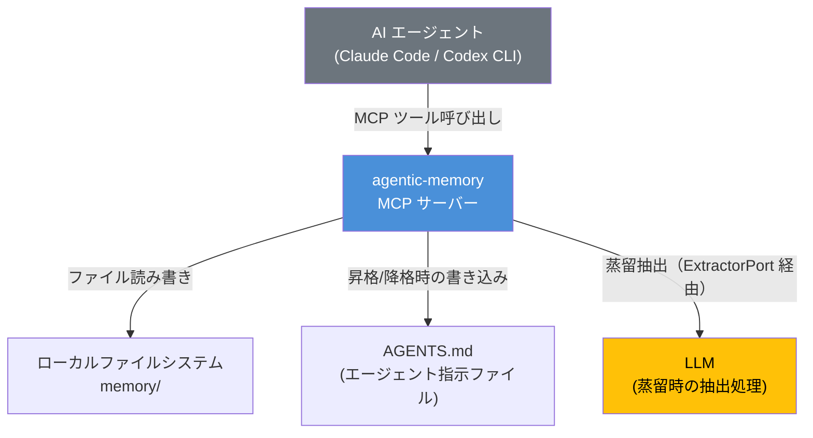
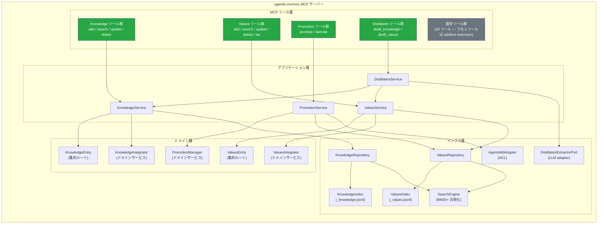
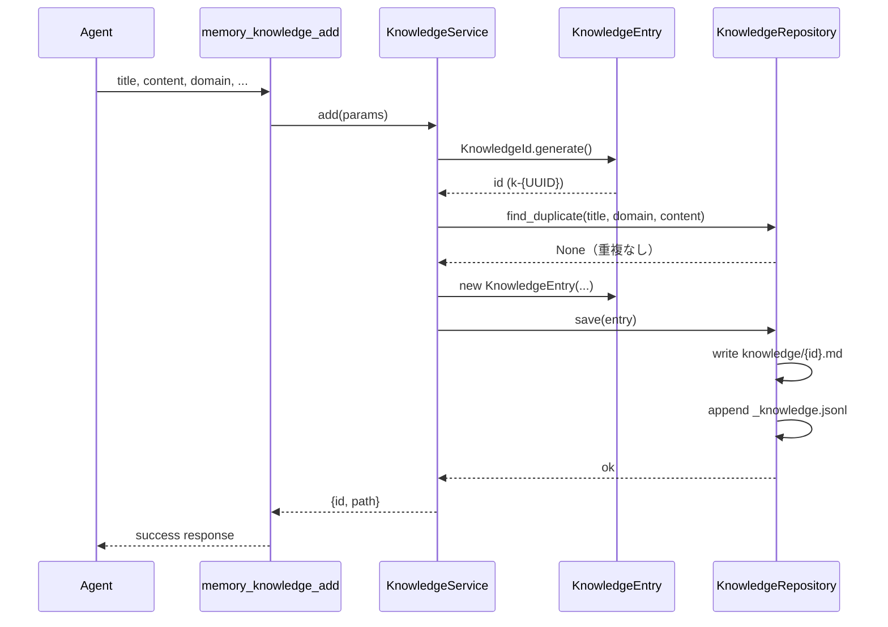
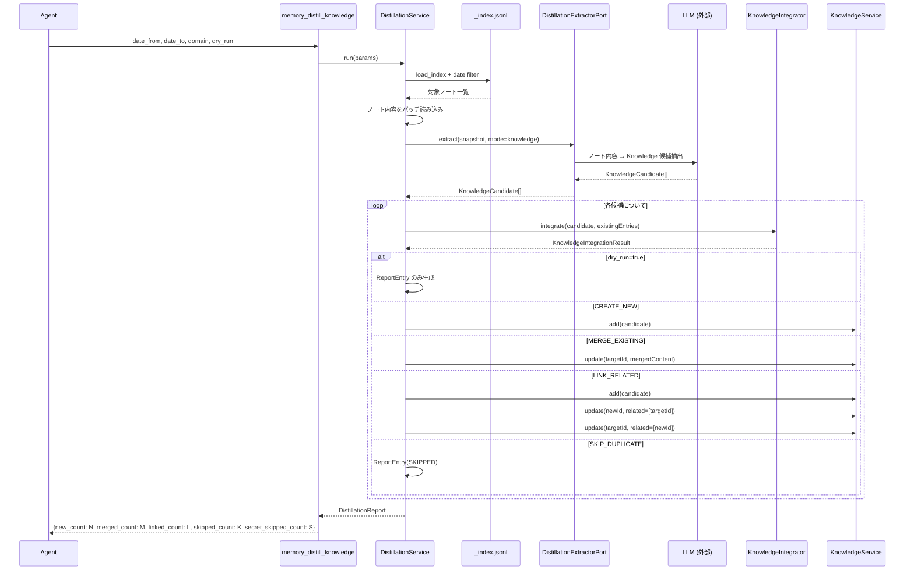
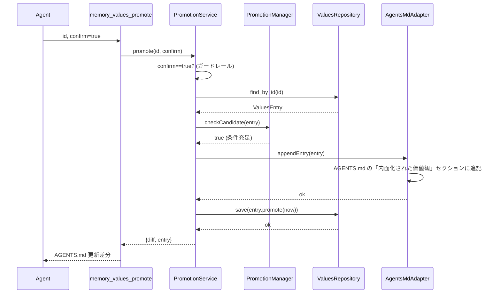
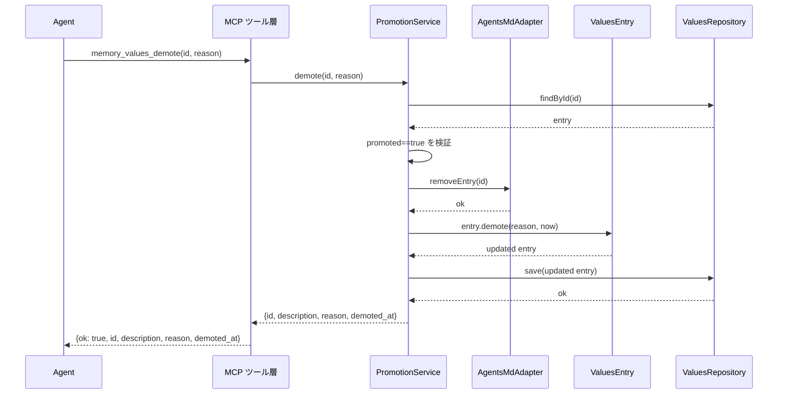
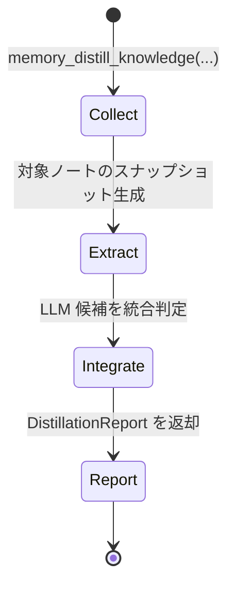

# アーキテクチャ設計: Knowledge & Values 拡張

| 項目 | 内容 |
|---|---|
| バージョン | 0.1.0（ドラフト） |
| 最終更新日 | 2026-04-10 |
| 関連要件 | [REQ-knowledge-values.md](../requirements/REQ-knowledge-values.md) |
| 関連ドメインモデル | [DOMAIN-MODEL-knowledge-values.md](DOMAIN-MODEL-knowledge-values.md) |

## 変更履歴

| バージョン | 日付 | 変更内容 |
|---|---|---|
| 0.1.0 | 2026-04-08 | 初版作成 |
| — | 2026-04-09 | レビュー指摘対応: F-01〜F-10（蒸留時機密スキップ、_state.md 日付フィルタ除外、CONTRADICT_EXISTING 根拠追記、BR-16 事後修復統一・削除部分失敗戦略追加、promoted 削除マーカー検証、REQ-NF-002 計測境界明確化、蒸留トリガー _state.md 除外根拠、health check lazy 生成セマンティクス） |
| — | 2026-04-09 | レビュー指摘対応（第2回）: §8.5 BM25 max-normalization 定義追加、§10.1 collect に Evidence.date 導出規則追加、§4.1 PromotionService/ValuesService に promoted 削除時 confirm 消費を反映、§9.8 promoted 削除の操作順序・部分失敗ハンドリング追加、§10.1 integrate ステップ番号の重複修正 |
| — | 2026-04-09 | レビュー指摘対応（第3回）: §8.5 の類似判定スコア正規化を Values 限定に修正（Knowledge の BM25 正規化はREQ/DOMAIN未定義のため除外） |
| — | 2026-04-09 | §9.8 ステップ4 復旧手順を `memory_values_promote` → `memory_health_check` 自動修復に変更（REQ-FUNC-016 再昇格禁止との矛盾解消） |
| — | 2026-04-09 | §9.8 ステップ4 復旧欄を実装に存在する操作のみで記述（`appendEntry` 冪等再挿入・promoted sync 差分修復の記述を除去） |
| — | 2026-04-09 | レビュー指摘対応（cross-doc review）: §15 要件トレーサビリティマトリクス追加、§10.1 collect を K/V 蒸留ごとに分離、§5.2 LINK_RELATED 復旧トリガーを明確化（`memory_health_check(fix=true)` のみ）、§11.1 health.py に related リンク整合性・promoted 同期チェック（detect + `fix=true` 時自動修復）を明記 |
| — | 2026-04-09 | レビュー指摘対応（再レビュー残件）: §15 に REQ-FUNC-014 を追加 |
| — | 2026-04-09 | レビュー指摘対応: §15 導入文のスコープを「Must 要件ごとに」→「全 Must + 設計対応のある Should」に修正（REQ-NF-007 は Should） |
| — | 2026-04-09 | §15 導入文のスコープ記述を「設計上の対応が存在する Should 要件」→「REQ-NF-007（Should）」に限定（表の実際の行集合と一致させる） |
| — | 2026-04-10 | レビュー残件対応: Phase 7 行/補足に REQ-FUNC-014 を反映、蒸留トリガー判定データをノート起点タイムスタンプ（`date` + `time`）ベース・`datetime` 精度に修正 |
| — | 2026-04-10 | レビュー残件対応: §10.1 collect の `_state.md` 由来 Evidence.date 導出規則をエントリの構造化日付プレフィックス（`[YYYY-MM-DD HH:MM]`）ベースに明確化 |
| — | 2026-04-10 | must/should 指摘対応: ReportEntry 公開フィールド表の casing を snake_case に統一（`candidate_summary` / `target_id`、enum 値を lower_snake_case に）、§1 品質特性表の GitHub Actions ランナー仕様に GitHub Docs 出典 URL を追加 |
| — | 2026-04-10 | レビュー差し戻し対応: §4.1 ValuesService 責務に降格提案通知（`demotion_candidate`）の経路を追記（`PromotionState.shouldSuggestDemotion()` 経由）、§15 REQ-FUNC-009 行に降格提案通知を追記、GitHub Actions 出典 URL を GitHub-hosted runners reference に修正 |

---

## 1. 品質特性と優先順位

| 優先度 | 品質特性 | 根拠 |
|---|---|---|
| 1 | **後方互換性** | 既存 19 MCP ツール・270+ テストケースを破壊しないこと（REQ-NF-003）。最優先の制約 |
| 2 | **保守性** | 既存 `core/` のフラットモジュール構造に Knowledge/Values/蒸留の3コンテキストを追加するため、モジュール境界の明確化が不可欠 |
| 3 | **拡張性** | 将来的な push 型配信・横断検索・降格メカニズム等の Could 要件への対応余地を確保 |
| 4 | **検索性能** | エントリ数 1,000 件以下で p95 500ms 以内（REQ-NF-001）。ベンチマークは GitHub Actions 標準ランナー（`ubuntu-latest`。ハードウェア仕様はリポジトリ可視性により異なる: private 2 vCPU / 8 GB RAM、public 4 vCPU / 16 GB RAM。2026-04-09 時点、[GitHub Docs: GitHub-hosted runners reference](https://docs.github.com/en/actions/reference/runners/github-hosted-runners) 準拠）または開発者ラップトップ（Apple Silicon M1+ / x86-64、8GB+ RAM、SSD）で計測する。既存 BM25+ エンジンの流用で達成可能 |
| 5 | **運用性** | `memory_init` のみでマイグレーション完了（REQ-NF-005）、health check 統合（REQ-NF-004） |

---

## 2. システムコンテキスト（C4 Level 1）



**システム境界の説明:**

- **agentic-memory MCP サーバー**: Knowledge/Values の CRUD・検索・昇格・蒸留パイプライン全体を担う。蒸留の「抽出」は内部の `DistillationExtractorPort` 経由で LLM に委譲し、抽出依頼・統合判定・結果永続化をオーケストレーションする。蒸留トリガー条件の正規定義（`DistillationTrigger`）を保持するが、ランタイムでの条件評価は行わない（エージェント/スキル側が公開ツールレスポンスから評価する。セクション 4.1・10.1・10.2 参照）
- **ローカルファイルシステム `memory/`**: 記憶ディレクトリ。現行実装の `config.py` は legacy の `daily_note/` ディレクトリも既定候補として扱うが、本設計では `memory/` を前提とする。`daily_note/` 配下に Knowledge/Values ディレクトリを作成するかは既存の `memory_dir` 解決ロジックに従い、本設計では明示的に対象外としない（`memory_dir` がどのパスに解決されても同じストレージ設計が適用される）
- **AGENTS.md**: Values 昇格時の書き込み先。外部システムとして ACL を介してアクセスする
- **LLM**: 蒸留パイプラインにおける抽出処理を担当。agentic-memory の外部依存として位置づける

---

## 3. コンテナ図（C4 Level 2）



---

## 4. 主要コンポーネントと責務

### 4.1 レイヤード構成

| レイヤー | コンポーネント | 責務 | 依存先 |
|---|---|---|---|
| **MCP ツール層** | `server.py` の新規ツール関数 | パラメータバリデーション、`memory_dir` 解決、アプリケーション層の呼び出し、`ok` 常在・`warnings` は警告時のみ付与のエンベロープ形式でのレスポンス整形 | アプリケーション層 |
| **アプリケーション層** | `KnowledgeService` | Knowledge CRUD のオーケストレーション、related の逆引き一括更新（[判断記録 2](DOMAIN-MODEL-knowledge-values.md#判断記録-2-knowledge-削除時の-related-一括更新をアプリケーション層の責務とする)） | ドメイン層、インフラ層 |
| | `ValuesService` | Values CRUD のオーケストレーション、昇格候補通知の組み込み（`add` 時と `update` 時の両方で `PromotionManager.checkCandidate()` を呼び出し、条件充足時にレスポンスに `promotion_candidate: true` フィールドを含める。条件を満たさない場合はフィールド自体を省略する）。降格提案通知の組み込み（`update` 時に `promoted: true` のエントリに対して `PromotionState.shouldSuggestDemotion(currentConfidence)` を呼び出し、条件充足時にレスポンスに `demotion_candidate: true` を含める。REQ-FUNC-034 参照）。`promoted: true` のエントリ削除時は `confirm` パラメータとともに `PromotionService.onDelete(id, confirm)` を呼び出し、AGENTS.md からの除去と `confirm` ガードレール検証を委譲する | ドメイン層、インフラ層、`PromotionService` |
| | `DistillationService` | 公開ツール契約を維持しつつ、対象ノート選定・抽出依頼・統合永続化をオーケストレーションする | `KnowledgeService`, `ValuesService`, `DistillationExtractorPort` |
| | `PromotionService` | 昇格/降格のワークフロー、`confirm` ガードレール（アプリケーション層で消費）、AGENTS.md 同期、排他制御。`onDelete(id, confirm)` メソッドで promoted Values 削除時の AGENTS.md 除去も担当する（`ValuesService` から委譲される）。promoted エントリの削除時は `confirm` ガードレールを `PromotionService.onDelete()` で消費する（promote と同等のパターン） | `PromotionManager`、`ValuesRepository`、`AgentsMdAdapter` |
| **ドメイン層** | `KnowledgeEntry` | Knowledge の不変条件の保護（ID 生成、sources マージ等） | なし（自己完結） |
| | `ValuesEntry` | Values の不変条件の保護（confidence 範囲、evidence 保持上限、状態遷移メソッド `promote()` / `demote(reason, now)`）。降格時の理由と日時は `PromotionState` に記録される | なし |
| | `KnowledgeIntegrator` | 蒸留候補と既存 Knowledge の重複検出・マージ判定 | なし |
| | `ValuesIntegrator` | 蒸留候補と既存 Values の重複検出・confidence 更新判定 | なし |
| | `PromotionManager` | 昇格条件判定、昇格/降格実行など純粋なドメインポリシー（`confirm` は受け取らない）。降格提案判定は `PromotionState.shouldSuggestDemotion()` に委譲（[判断記録 3](DOMAIN-MODEL-knowledge-values.md#判断記録-3-shouldsuggestdemotion-の配置)） | なし |
| | `DistillationTrigger` | 蒸留トリガー条件の**正規定義**（REQ-FUNC-026: 10 ノート以上 OR 168 時間以上経過）。蒸留種別（Knowledge / Values）ごとにインスタンス化し、ノート数閾値・期間閾値を保持する。トリガー条件は最終評価日時（`last_*_evaluated_at`）を基準にタイムスタンプ精度で判定する。`DistillationService` の内部コンポーネントであり、公開 API としては露出しない。**ランタイムでのトリガー条件評価はエージェント/スキル側が公開ツールレスポンス（`memory_state_show` + `memory_stats`）から行う。MCP サーバー側はトリガー条件を自動評価しない**。`DistillationTrigger` の役割は条件定数の正規ソースおよびユニットテスト時の判定ロジック提供に限定される（セクション 13「Phase 7 の AGENTS.md / retrospective 連携設計」参照） | なし（`_state.md` の蒸留日時は `DistillationService` 経由で取得） |
| **インフラ層** | `KnowledgeRepository` | Knowledge の永続化（Markdown + frontmatter）、インデックス同期 | `SearchEngine` |
| | `ValuesRepository` | Values の永続化、インデックス同期 | `SearchEngine` |
| | `SearchEngine` | BM25+ スコアリングの汎用化（既存 `scorer.py` / `search.py` の拡張） | なし |
| | `DistillationExtractorPort` | 蒸留時の LLM 抽出を外部実行基盤へ委譲するポート。公開 MCP API は変更しない | なし |
| | `AgentsMdAdapter` | AGENTS.md の「内面化された価値観」セクション操作（ACL） | なし |

### 4.2 既存モジュールとの対応

| 新規コンポーネント | 実装場所（提案） | 既存モジュールとの関係 |
|---|---|---|
| `KnowledgeService` | `core/knowledge/service.py` | `note.py` と並列。ファイル作成ユーティリティは `note.py` から流用可 |
| `ValuesService` | `core/values/service.py` | 同上 |
| `DistillationService` | `core/distillation/service.py` | 新規。ノート読み込みに `scorer.py` の `load_index` を利用 |
| `DistillationExtractorPort` | `core/distillation/extractor.py` | 新規。CLI / API / 将来の provider を差し替える抽出境界 |
| `DistillationTrigger` | `core/distillation/trigger.py` | 新規。蒸留トリガー条件の正規定義（`DistillationService` 内部コンポーネント）。`_state.md` の最終評価日時（`last_*_evaluated_at`）と最終永続化日時（`last_*_distilled_at`）を `DistillationService` 経由で取得 |
| `PromotionService` | `core/values/promotion.py` | `state.py` のセクション操作パターンを参考にする |
| `KnowledgeEntry` | `core/knowledge/model.py` | 新規。`dataclass` ベース |
| `ValuesEntry` | `core/values/model.py` | 新規。`dataclass` ベース |
| `KnowledgeRepository` | `core/knowledge/repository.py` | `index.py` の upsert/load パターンを踏襲 |
| `ValuesRepository` | `core/values/repository.py` | 同上 |
| `SearchEngine`（汎用化） | `core/scorer.py` + `core/search.py`（拡張） | 既存の `IndexEntry` / `score_entry` / 検索関数を汎用化。`scorer.py` にフィールドマッピング受け取りの `score_generic_entry` を追加、`search.py` にインデックスパスとエントリ型をパラメータ化した汎用検索関数を追加 |
| `AgentsMdAdapter` | `core/values/agents_md.py` | 新規。Markdown セクション操作 |
| `SecretScanPolicy` | `core/security.py` | 新規実装。正規表現ベースのシークレット検出ユーティリティ |

### 4.3 ディレクトリ構成（提案）

```
src/agentic_memory/
├── core/
│   ├── knowledge/           # 新規: Knowledge コンテキスト
│   │   ├── __init__.py
│   │   ├── model.py         # KnowledgeEntry, KnowledgeId, Source 等
│   │   ├── service.py       # KnowledgeService
│   │   ├── repository.py    # KnowledgeRepository
│   │   └── integrator.py    # KnowledgeIntegrator
│   ├── values/              # 新規: Values コンテキスト
│   │   ├── __init__.py
│   │   ├── model.py         # ValuesEntry, ValuesId, Confidence 等
│   │   ├── service.py       # ValuesService
│   │   ├── repository.py    # ValuesRepository
│   │   ├── integrator.py    # ValuesIntegrator
│   │   ├── promotion.py     # PromotionService, PromotionManager
│   │   └── agents_md.py     # AgentsMdAdapter (ACL)
│   ├── distillation/        # 新規: 蒸留コンテキスト
│   │   ├── __init__.py
│   │   ├── service.py       # DistillationService
│   │   ├── extractor.py     # DistillationExtractorPort
│   │   └── trigger.py       # DistillationTrigger
│   ├── index.py             # 既存（変更なし）
│   ├── search.py            # 既存（軽微な拡張: 汎用インデックス対応）
│   ├── scorer.py            # 既存（軽微な拡張: フィールドマッピング汎用化）
│   ├── note.py              # 既存（変更なし）
│   ├── security.py          # 新規: SecretScanPolicy（機密情報除外）
│   ├── state.py             # 既存（拡張: フロントマター読み書き追加（蒸留日時 4 フィールド） — セクション 11.1 参照）
│   ├── health.py            # 既存（拡張: K/V インデックス整合性チェック追加）
│   └── ...                  # 既存モジュール群（変更なし）
├── server.py                # 既存（拡張: 新規ツール関数追加）
└── __init__.py
```

---

## 5. データフロー

### 5.1 Knowledge 登録フロー



### 5.2 蒸留フロー（Memory → Knowledge）



**補足**: 上記は Knowledge 蒸留のレスポンス。Values 蒸留（`memory_distill_values`）の場合、`DistillationReport` は `{new_count: N, reinforced_count: R, contradicted_count: C, skipped_count: K, secret_skipped_count: S}` を返す（`merged_count` / `linked_count` は 0、代わりに `reinforced_count` / `contradicted_count` を使用）。`DistillationReport` は7種の集計フィールド（`new_count` / `merged_count` / `linked_count` / `reinforced_count` / `contradicted_count` / `skipped_count` / `secret_skipped_count`）を持ち、蒸留種別に応じて該当フィールドのみ非ゼロとなる。`secret_skipped_count` は蒸留種別を問わず、integrate 段で機密検出によりスキップされたエントリ数を計上する。ドメインモデル（[DOMAIN-MODEL §3.3](DOMAIN-MODEL-knowledge-values.md#33-蒸留コンテキスト)）では camelCase（`newCount` 等）で定義しており、MCP ツール層（`server.py`）で snake_case wire 名に変換する。

**`DistillationReport` の公開フィールド:**

| フィールド | 型 | 説明 |
|---|---|---|
| `new_count` | int | 新規作成されたエントリ数 |
| `merged_count` | int | 既存エントリにマージされた数（Knowledge のみ非ゼロ） |
| `linked_count` | int | 関連リンクで接続された数（Knowledge のみ非ゼロ） |
| `reinforced_count` | int | 既存エントリの confidence が強化された数（Values のみ非ゼロ） |
| `contradicted_count` | int | 既存エントリと矛盾が検出された数（Values のみ非ゼロ） |
| `skipped_count` | int | 重複等によりスキップされた数 |
| `secret_skipped_count` | int | 機密検出によりスキップされた数 |
| `entries` | list[ReportEntry] | 候補ごとの詳細結果一覧 |

各 `ReportEntry` は以下のフィールドを持つ（正規定義は [DOMAIN-MODEL-knowledge-values.md §3.3](DOMAIN-MODEL-knowledge-values.md#33-蒸留コンテキスト)）:

| フィールド | 型 | 説明 |
|---|---|---|
| `outcome` | DistillationOutcome | `created` / `merged` / `linked` / `reinforced` / `contradicted` / `skipped` / `secret_skipped` |
| `candidate_summary` | string | 蒸留候補の要約 |
| `target_id` | string? | 統合先の既存エントリ ID（`created` / `secret_skipped` では `null`） |
| `detail` | string? | 操作の補足情報（新規作成されたエントリ ID、マージ理由等。該当なしの場合は `null`） |

`DistillationReport` の詳細なドメインモデル定義は [DOMAIN-MODEL-knowledge-values.md §3.3](DOMAIN-MODEL-knowledge-values.md#33-蒸留コンテキスト) を参照。

**`LINK_RELATED` の `update` 呼び出しセマンティクス:** シーケンス図中の `update(id, related=[...])` は REQ-FUNC-006 の `related` パラメータ定義に従い、既存の `related` リストへの**追加**（マージ）として動作する。既存の `related` を置換するものではない。

**LINK_RELATED の部分失敗時の整合性:** `LINK_RELATED` は3ステップの複合操作（候補の新規登録 → 新規エントリに `related` 追加 → 既存エントリに `related` 追加）であり、途中で失敗すると片方向リンクが残る可能性がある。以下の整合性保証が働く:

1. **検出**: `memory_health_check`（REQ-NF-004 の `related` リンク整合性チェック）で、`related` に含まれる ID が存在しないエントリを参照している orphan link を検出する。また、片方向リンク（A→B は存在するが B→A が存在しない）も検出する
2. **復旧**: `memory_health_check(fix=true)` 実行時に `KnowledgeService` を介して修復する。orphan link は `related` から除去し、片方向リンクは逆方向の link を追加して双方向に揃える。**修復トリガーは `memory_health_check(fix=true)` のみ**であり、CRUD 操作中に自動修復は行わない
3. **設計判断**: ファイルベースストレージでトランザクション保証がないため、操作単位でのロールバックではなく、事後検出・事後修復のアプローチを採用する（Values 昇格フロー §5.3 の部分失敗戦略と同じ方針）

### 5.3 Values 昇格フロー



**部分失敗時の整合性:** AGENTS.md 書き込み（不可逆影響が大きい操作）を先に実行し、成功後に Values エントリを更新する。Values エントリの更新が失敗した場合、以下の整合性保証が働く:

1. **検出**: `memory_health_check`（REQ-FUNC-028）の `syncCheck()` が「AGENTS.md にエントリが存在するが、対応する Values の `promoted` が `false`」という方向の不整合を検出・報告する
2. **復旧**: `memory_health_check(fix=true)` を実行する。promoted 同期の修復処理（REQ-FUNC-028 の「復旧経路」）により、AGENTS.md 側の孤立エントリを除去し、Values エントリ側の欠落を AGENTS.md に再挿入する。この修復は `memory_values_promote` の再実行とは異なる操作であり、既に `promoted: true` であるエントリの再昇格禁止（REQ-FUNC-016）には抵触しない

### 5.4 Values 一括参照フロー

**対応要件**: [REQ-FUNC-025](../requirements/REQ-knowledge-values.md#req-func-025-values-一括参照)

`memory_values_list` は `ValuesService` を経由して `ValuesRepository` からエントリを取得し、フィルタリング・ソートを適用する。既存の検索パイプライン（`score_generic_entry`）は使用せず、インデックス（`_values.jsonl`）の直接走査で実現する。

**処理フロー:**
1. MCP ツール層: パラメータバリデーション（`min_confidence` の範囲チェック、`promoted_only` の型チェック、`top` の正整数チェック）
2. `ValuesService.list(min_confidence, category, promoted_only, top)`: `ValuesRepository` から全エントリを取得
3. フィルタ適用: `min_confidence` 指定時は `confidence >= min_confidence` で絞り込み。`category` 指定時は `category` が一致するエントリのみに絞り込み。`promoted_only=true` 時は `promoted == true` で絞り込み
4. ソート: `confidence` 降順。同値の場合は `updated_at` 降順（REQ-FUNC-025 準拠）
5. 件数制限: `top` 指定時はソート後の先頭 `top` 件に切り詰め（デフォルト: 20）
6. レスポンス整形: `{ok: true, entries: [...]}` 形式。各エントリは `id`, `description`, `category`, `confidence`, `promoted`, `evidence_count` を含む

### 5.5 Values 降格フロー

**対応要件**: [REQ-FUNC-034](../requirements/REQ-knowledge-values.md#req-func-034-values-降格撤回)



**責務配置:**
- `PromotionService`: `reason` 検証（空文字拒否）、`promoted: true` 検証、AGENTS.md マーカー検証（`BEGIN/END:PROMOTED_VALUES`。欠落時は `memory_init` 再実行を案内するエラー）、`AgentsMdAdapter.removeEntry()` による AGENTS.md 除去、`ValuesEntry.demote()` の呼び出し
- `AgentsMdAdapter`: AGENTS.md から該当エントリの行を削除（排他ロック + atomic write）
- `ValuesEntry.demote(reason, now)`: `PromotionState` を更新（`promoted: false`, `demotionReason: reason`, `demotedAt: now`）
- `ValuesRepository`: 更新された `values/{id}.md` と `_values.jsonl` を永続化

**部分失敗:** 昇格フロー（§5.3）と同じ方針。AGENTS.md 除去を先行し、Values エントリ更新失敗時は `memory_health_check` の `syncCheck()` で検出する。

### 5.6 Promoted Values 削除プレビュー

**対応要件**: [REQ-FUNC-024](../requirements/REQ-knowledge-values.md#req-func-024-values-削除)（`promoted: true` かつ `confirm=false` の場合）

`promoted: true` のエントリに対して `memory_values_delete(id, confirm=false)` が呼び出された場合、削除は実行せず、プレビューレスポンスを返す。

**責務配置:**
- `ValuesService.delete(id, reason, confirm)`: `promoted: true` を検出した場合、`PromotionService.onDelete(id, confirm)` に委譲
- `PromotionService.onDelete(id, confirm=false)`: プレビュー生成を行いエラーレスポンスを返す
  1. `ValuesRepository.findById(id)` でエントリを取得
  2. エントリの `description`, `category`, `confidence` からプレビュー概要を生成
  3. `AgentsMdAdapter.findEntryLine(id)` で AGENTS.md から該当行のテキストを取得
  4. エラーレスポンスとして返却

**プレビューレスポンス形状:**

```json
{
  "ok": false,
  "error": "confirmation_required",
  "preview": {
    "id": "v-...",
    "description": "エントリの要約",
    "category": "...",
    "confidence": 0.85,
    "agents_md_line": "AGENTS.md から除去される行のテキスト"
  },
  "message": "promoted Values の削除には confirm: true が必要です"
}
```

---

## 6. 同期/非同期境界

| 操作 | 同期/非同期 | 理由 |
|---|---|---|
| Knowledge/Values CRUD | **同期** | ファイル I/O + インデックス更新。レイテンシは低い（ミリ秒単位） |
| Knowledge/Values 検索 | **同期** | BM25+ スコアリング。p95 500ms 以内の要件を同期で達成可能 |
| 蒸留・前処理（collect: ノート選定） | **同期** | インデックス読み込み + 日付範囲フィルタリング。軽量処理 |
| 蒸留・抽出（extract） | **同期（外部 extractor 呼び出し）** | 公開ツール呼び出しの中で `DistillationExtractorPort` を経由して外部 LLM/CLI を呼ぶ |
| 蒸留・後処理（integrate: 統合・永続化） | **同期** | 統合判定 + CRUD 呼び出し。ツール内で同期完了 |
| AGENTS.md 書き込み | **同期** | 単一ファイル更新だが、複数セッション競合に備えて `fcntl` ロック + atomic write を行う |
| health check | **同期** | ファイルシステム走査。既存パターンと同一 |

**蒸留の性能境界:** collect + integrate の合計処理時間は REQ-NF-002 により 100 ノートあたり 5 秒以内。extract は外部依存（LLM）のため計測対象外。

**蒸留の公開 API 方針**: `memory_distill_knowledge` / `memory_distill_values` の公開パラメータは REQ-FUNC-010/011 に定義されたものから増やさない。内部では以下の3段階で処理する:

1. **collect**: 対象ノートの選定・読み込み
2. **extract**: `DistillationExtractorPort` 経由で LLM 抽出を実行
3. **integrate**: 統合判定と永続化を行い、`DistillationReport` を返却

`dry_run=true` の場合も同じパイプラインを通るが、永続化は行わず候補と統合結果のみを返す。

---

## 7. ストレージ設計

### 7.1 ファイルレイアウト

```
memory/
├── _state.md                # 既存（パスは据え置き。YAML フロントマターに蒸留日時 4 フィールドを追加拡張: last_*_distilled_at, last_*_evaluated_at）
├── _index.jsonl             # 既存: Memory ノートインデックス（変更なし）
├── _knowledge.jsonl         # 新規: Knowledge インデックス
├── _values.jsonl            # 新規: Values インデックス
├── knowledge/               # 新規
│   └── {id}.md              # Markdown + YAML frontmatter（id は `k-` プレフィックス付き）
├── values/                  # 新規
│   └── {id}.md              # Markdown + YAML frontmatter（id は `v-` プレフィックス付き）
└── YYYY-MM-DD/              # 既存（変更なし）
```

**列挙値の表記規約:** 要件定義書（REQ）では API レベルの表現として小文字スネークケース（例: `verified`, `likely`, `uncertain`, `unknown`, `novice`）を使用し、ドメインモデルでは言語非依存の列挙表記として大文字（例: `VERIFIED`, `LIKELY`, `UNCERTAIN`, `UNKNOWN`, `NOVICE`）を使用する。永続化層（YAML frontmatter / JSONL）では要件定義書の小文字表記に従う。

### 7.2 Knowledge エントリ形式（例）

```markdown
---
id: k-a1b2c3
title: Rust の所有権ルール
domain: rust
tags: [ownership, borrow-checker, memory-safety]
accuracy: verified
source_type: memory_distillation
user_understanding: familiar
sources:
  - type: memory_distillation
    ref: memory/2026-03-15/1430_rust-ownership-deep-dive.md
    summary: セッション中に所有権ルールの詳細を調査
related: [k-d4e5f6]
created_at: "2026-03-20T10:30:00"
updated_at: "2026-04-01T15:00:00"
---

Rust の所有権ルール:
1. 各値は一つのオーナーを持つ
2. オーナーがスコープを抜けると値は破棄される
3. 参照は可変参照1つ、または不変参照複数のいずれか
```

### 7.3 Knowledge インデックスエントリ形式（_knowledge.jsonl）

```json
{
  "id": "k-a1b2c3",
  "path": "knowledge/k-a1b2c3.md",
  "title": "Rust の所有権ルール",
  "domain": "rust",
  "tags": ["ownership", "borrow-checker", "memory-safety"],
  "accuracy": "verified",
  "source_type": "memory_distillation",
  "user_understanding": "familiar",
  "content_preview": "Rust の所有権ルール: 1. 各値は一つのオーナーを持つ...",
  "related": ["k-d4e5f6"],
  "created_at": "2026-03-20T10:30:00",
  "updated_at": "2026-04-01T15:00:00"
}
```

### 7.4 Values インデックスエントリ形式（_values.jsonl）

```json
{
  "id": "v-m3n4o5",
  "path": "values/v-m3n4o5.md",
  "description": "バグ修正時は最小侵入修正を優先し、周辺コードのリファクタリングを同時に行わない",
  "category": "coding-style",
  "confidence": 0.92,
  "evidence_count": 8,
  "promoted": true,
  "promoted_at": "2026-04-05T14:00:00",
  "promoted_confidence": 0.85,
  "demotion_reason": null,
  "demoted_at": null,
  "created_at": "2026-03-10T09:00:00",
  "updated_at": "2026-04-05T14:00:00"
}
```

**補足:** `demotion_reason` / `demoted_at` は降格が実行された場合にのみ値が設定される。降格後に再昇格された場合、`promoted` が `true` に戻り、`demotion_reason` / `demoted_at` は直近の降格記録として残る。

### 7.5 検索インデックスの設計方針

既存の `_index.jsonl` は Memory ノート専用であり、フィールド構造（title/date/tags/keywords/files/decisions/next 等）が Memory ドメインに特化している。Knowledge/Values インデックスは以下の理由で別ファイルとする:

- **フィールド構造の差異**: Knowledge は domain/accuracy/user_understanding、Values は confidence/evidence_count/promoted 等、固有のフィルタフィールドを持つ
- **検索の独立性**: 各ツール（`memory_knowledge_search` / `memory_values_search`）は専用インデックスのみを参照し、不要なエントリのスコアリングを回避
- **既存インデックスへの影響ゼロ**: `_index.jsonl` のスキーマ・書き込みロジックに一切変更を加えない

### 7.6 機密情報除外ポリシー

REQ-NF-007 に対応するため、永続化前に `KnowledgeService` / `ValuesService` / `PromotionService` で共通の `SecretScanPolicy` を適用する。

- `memory_knowledge_add` / `memory_knowledge_update` / `memory_values_add` / `memory_values_update`（直接呼び出し）:
  シークレット検出時は保存自体は継続可能としつつ、警告をレスポンスへ含める。ユーザーが警告を確認し対処を判断できるインタラクティブな文脈を前提とする
- 蒸留パイプライン（`DistillationService`）の integrate ステップ:
  上記 add/update を内部的に呼び出すが、機密検出警告が返された場合は該当エントリの永続化をスキップし `secret_skipped_count` に計上する（§10.1 参照）。蒸留は自律的プロセスでありユーザー判断を介在させられないため、機密候補は永続化しない
- `memory_values_promote`:
  AGENTS.md への書き込みは不可逆影響が大きいため、シークレット検出時は警告ではなく昇格を拒否する
- 実装:
  正規表現ベースのシークレット検出器を `core/security.py` として新規実装する（既存リポジトリ内に再利用可能な検出器は存在しない）。一般的なシークレットパターン（AWS キー、API トークン、GitHub PAT 等）をカバーする薄いユーティリティとし、Memory 本体には影響させない

### 7.7 削除の部分失敗戦略

Knowledge / Values の削除はファイル（`knowledge/{id}.md` / `values/{id}.md`）→ インデックス（`_knowledge.jsonl` / `_values.jsonl`）の順序で実行する。

- **ファイル削除成功 → インデックス削除失敗**: `memory_health_check` が orphan index entry（ファイルなしのインデックスエントリ）として検出・報告する
- **ファイル削除失敗**: エラーを返し、インデックスは変更しない

事後検出・事後修復モデルであり、トランザクション保証は持たない（セクション 5.2 の LINK_RELATED 部分失敗時の整合性保証と同じ方針）。

---

## 8. 検索エンジン統合方針

### 8.1 既存エンジンの汎用化

既存の BM25+ エンジン（`scorer.py` / `search.py`）は `IndexEntry` dataclass と固定のフィールド重みに依存している。これを以下の方針で汎用化する:

```
既存: IndexEntry (path, title, date, tags, keywords, ...) → score_entry()
汎用: GenericEntry protocol → score_generic_entry(entry, field_config)
```

**汎用化の範囲:**

| コンポーネント | 変更内容 |
|---|---|
| `scorer.py` | `score_entry` に加え、フィールドマッピングを受け取る `score_generic_entry` を追加。既存の `score_entry` はそのまま維持（後方互換） |
| `search.py` | インデックスパスとエントリ型をパラメータ化した汎用検索関数を追加。既存の検索関数はそのまま維持 |
| `query.py` | 変更なし（クエリパース・展開ロジックは共通利用可能） |

### 8.2 フィールド重み設定（Knowledge）

| フィールド | BM25 重み | 理由 |
|---|---|---|
| `title` | 3.0 | トピック特定に最重要 |
| `content_preview` | 1.5 | 内容マッチング |
| `domain` | 2.0 | ドメインフィルタとしても使用 |
| `tags` | 2.0 | 明示的なタグ付け |

### 8.3 フィールド重み設定（Values）

| フィールド | BM25 重み | 理由 |
|---|---|---|
| `description` | 3.0 | 価値観の記述が検索の主軸 |
| `category` | 2.0 | カテゴリフィルタとしても使用 |

### 8.4 dense / rerank の適用方針

- デフォルトは **BM25 のみ**。Knowledge / Values は初期件数が少なく、REQ-NF-001 の範囲では dense index や rerank の常時利用は過剰
- `query.py` のクエリ展開は再利用するが、`memory_knowledge_search` / `memory_values_search` では初期実装で dense auto-enable を無効化する
- rerank は将来の件数増加時に設定で有効化できる設計とし、初期段階ではモデルダウンロードを伴う open-world 動作を避ける
- Could 要件の横断検索（REQ-FUNC-032）を実装する時点で、Memory / Knowledge / Values 横断の rerank 戦略を再評価する

### 8.5 Values 類似判定のスコア正規化

`memory_values_add` の類似判定（REQ-FUNC-007）で使用する BM25+ スコアの正規化方法:

1. 候補の `description` を検索クエリとして `_values.jsonl` に対し BM25+ スコアリングを実行する
2. 結果セット内の最大生スコア（`max_score`）を取得する
3. 各エントリのスコアを `score / max_score` で正規化する（max-normalization、範囲 0.0–1.0）
4. `max_score == 0`（ヒットなし）の場合は類似候補なしと判定する
5. 正規化スコアが閾値（REQ-FUNC-007: 0.7）以上のエントリを類似候補として返す

**Knowledge の重複検出との違い:** `memory_knowledge_add`（REQ-FUNC-004）は `title` + `domain` + `content` の厳密一致による重複チェックのみを行い、BM25 スコア正規化による類似判定は使用しない。Knowledge の類似判定は蒸留パイプラインの `KnowledgeIntegrator`（REQ-FUNC-012）が LLM ベースで担う。

**既存検索との違い:** `memory_values_search` / `memory_knowledge_search` の検索結果ランキングでは生スコア順を使用し、正規化は行わない。正規化は Values の類似判定（重複検出）専用の処理である。

---

## 9. AGENTS.md 連携設計

### 9.1 セクション構造

```markdown
## 内面化された価値観

<!-- BEGIN:PROMOTED_VALUES (agentic-memory managed — do not edit manually) -->

- バグ修正時は最小侵入修正を優先し、周辺コードのリファクタリングを同時に行わない
  （confidence: 0.92, evidence: 8件, id: v-m3n4o5）
- コミットは論理的な変更単位で分割し、1コミット1関心事を徹底する
  （confidence: 0.88, evidence: 6件, id: v-p6q7r8）

<!-- END:PROMOTED_VALUES -->
```

### 9.2 昇格 Values のテキスト形式（正規定義）

各昇格 Values は以下の **正規シリアライゼーション** で AGENTS.md に書き込まれる。この形式が書き込み・読み取り・同期チェック（`syncCheck()`）の共通基準となる:

```
- {description}（1行、最大200文字。改行はスペースに置換）
  （confidence: {value}, evidence: {count}件, id: {id}）
```

**正規化ルール（投影処理）:**
1. `description` が 200 文字を超える場合は末尾を `…` で切り詰める
2. `description` 内の改行をスペースに置換する
3. `description` に含まれる HTML コメントマーカー（`<!--`, `-->`）はエスケープまたは除去する
4. `BEGIN:PROMOTED_VALUES` / `END:PROMOTED_VALUES` を含む文字列は拒否する

**参照ポイント:** `syncCheck()`（セクション 9.3, 9.7）および `memory_health_check`（REQ-FUNC-028）は、上記の正規化ルールを適用した投影後テキストで比較を行う。

### 9.3 AgentsMdAdapter の責務

| 操作 | 処理 |
|---|---|
| `appendEntry(entry)` | `END:PROMOTED_VALUES` マーカーの直前に新規行を挿入 |
| `removeEntry(id)` | セクション内から `id: {id}` を含む行ブロックを削除 |
| `listEntries()` | セクション内の全エントリを `ValuesId` 付きでパース |
| `syncCheck()` | Values ストアの `promoted: true` とセクション内容の差分を検出。比較対象は `id`（存在有無）と `description`（セクション 9.2 の正規化ルールで投影したテキストとの一致）。`confidence` / `evidence` 件数はプロモーション時点のスナップショット値であり、同期チェックの対象外（後述の同期スコープ参照） |
| `writeAtomically(entries)` | `fcntl` ロック取得後に temp file + `os.replace()` でセクション全体を更新 |

### 9.4 ACL（腐敗防止層）の必要性

AGENTS.md は Markdown テキスト形式の外部ファイルであり、Values ドメインモデルとは異なる表現形式を持つ。`AgentsMdAdapter` が以下の変換を担う:

- **Values → AGENTS.md**: `ValuesEntry` → 人間可読な1行記述 + メタデータ注釈
- **AGENTS.md → Values**: セクション内テキスト → `ValuesId` + 概要（同期チェック用）

### 9.5 AGENTS.md のパス解決

AGENTS.md のパスは以下の優先順位で解決する:

1. 環境変数 `AGENTS_MD_PATH`（明示指定）
2. `memory_dir` の親ディレクトリの `AGENTS.md`（デフォルト構成ではリポジトリルートに相当するが、`memory_dir` が明示指定された場合は必ずしもリポジトリルートとは限らない）
3. 同親ディレクトリの `CLAUDE.md`（symlink 考慮）

**解決失敗時の挙動（REQ-FUNC-003 準拠）:**
- `memory_init`: マーカー挿入をスキップし警告を返す（AGENTS.md が存在しなくても init 自体は成功する）
- `memory_values_promote` / `memory_values_demote` / `memory_values_delete`（promoted エントリ）: エラーを返す（書き込み先が存在しない状態での操作は不正）。特に `memory_values_delete`（promoted エントリ）では、マーカー欠落状態で Values エントリのみ削除すると AGENTS.md に孤立した昇格テキストが残り修復不能となるため、削除全体を拒否する

### 9.6 書き込み整合性

- AGENTS.md 更新は `index.py` と同じ設計原則を採用し、`fcntl` による排他と atomic write を必須にする
- 書き込み前に `BEGIN/END` マーカーの存在を検証し、欠落時は fail-fast でエラーにする（マーカー挿入は `memory_init` の責務。昇格/降格時に欠落していれば `memory_init` の再実行を案内する）
- `memory_health_check` は `promoted=true` の Values と AGENTS.md セクションの双方向整合性を検証する

### 9.7 同期スコープ

AGENTS.md に表示される `confidence` と `evidence` 件数はプロモーション実行時点のスナップショット値であり、Values エントリの更新に追従して自動更新はしない。理由:

- 毎回の `memory_values_update` で AGENTS.md を書き換えると、ファイルロック競合と不要な差分が増加する
- AGENTS.md はエージェントの行動指針テキストとして読まれるため、description の正確性が最重要。数値メタデータの即時反映は必須でない

`syncCheck()` の比較対象:

| フィールド | 同期チェック対象 | 理由 |
|---|---|---|
| `id` | **対象**（存在有無の双方向チェック） | 昇格/降格の整合性の根幹 |
| `description` | **対象**（投影後テキスト一致チェック） | 行動指針テキストの正確性。セクション 9.2 の正規化ルール（投影処理）を適用した値で比較 |
| `confidence` | 対象外 | プロモーション時のスナップショット値 |
| `evidence` 件数 | 対象外 | プロモーション時のスナップショット値 |

### 9.8 Promoted エントリ削除の操作順序と部分失敗

`memory_values_delete`（`promoted: true`）の操作順序:

1. `confirm == true` を検証（§4.1 PromotionService 参照）
2. AGENTS.md の `BEGIN/END:PROMOTED_VALUES` マーカー存在を検証（欠落時は fail-fast）
3. AGENTS.md から該当エントリの行を削除（排他ロック + atomic write）
4. `values/{id}.md` を削除
5. `_values.jsonl` から該当エントリを削除

**部分失敗時の整合性:**

| 失敗箇所 | 状態 | 検出 | 復旧 |
|---|---|---|---|
| ステップ 2（マーカー欠落） | 何も変更されない | 即座にエラー返却 | `memory_init` の再実行を案内 |
| ステップ 3（AGENTS.md 書き込み失敗） | 何も変更されない | 即座にエラー返却 | リトライ |
| ステップ 4（ファイル削除失敗） | AGENTS.md からは除去済み、Values ファイルおよび `_values.jsonl` エントリは残存 | 操作がエラーを返却 | `values/{id}.md` を手動削除し、`memory_health_check(fix=true)` で orphan index エントリを除去して削除を完了する |
| ステップ 5（インデックス削除失敗） | ファイルは削除済み、インデックスに orphan エントリ残存 | `memory_health_check` が orphan index entry を検出 | `memory_health_check(fix=true)` による orphan エントリ除去 |

**設計原則:** 昇格フロー（§5.3）と同じ「外部影響の大きい操作を先に実行し、内部状態の不整合は事後検出・事後修復」モデルに統一する。

---

## 10. 蒸留フロー詳細

### 10.1 内部 3 段階パイプライン

公開ツールは単一呼び出しのまま維持し、内部実装だけを `collect -> extract -> integrate` の3段階に分ける。



**collect:**

`memory_distill_*` が呼び出された時点で直接パイプラインを実行する。**MCP サーバー（`DistillationService`）はトリガー条件を評価しない。**トリガー条件の評価はエージェント/スキル側が公開ツールレスポンス（`memory_state_show` + `memory_stats`）を用いて行う責務であり（セクション 13「Phase 7 の AGENTS.md / retrospective 連携設計」参照）、パイプライン内では行わない。

**Knowledge 蒸留（`memory_distill_knowledge`）の collect:**
1. 対象期間の Memory ノートを `_index.jsonl` から選定（`date_from` / `date_to` は `YYYY-MM-DD` 形式、両端 inclusive。無効な範囲はバリデーションエラー。詳細は REQ-FUNC-010 参照）
2. ノート内容の Decisions / Pitfalls & Remaining Issues / Results / Work Log セクション（日本語エイリアス: 判断 / 注意点・残課題 / 成果 / 作業ログ）を読み込み。セクション識別はテンプレート言語に依存しない正規化済みセクション名で行う
3. 抽出用の `DistillationSnapshot` を構築

**Values 蒸留（`memory_distill_values`）の collect:**
1. 対象期間の Memory ノートを `_index.jsonl` から選定（Knowledge 蒸留と同一の日付フィルタ仕様）
2. ノート内容の Decisions セクション（日本語エイリアス: 判断）を重点的に読み込み。セクション識別はテンプレート言語に依存しない正規化済みセクション名で行う（REQ-FUNC-011 参照: Values 蒸留の入力は判断履歴に特化しており、Knowledge 蒸留の広範な4セクションとは異なる）
3. MemoryNote に加えて `_state.md` の「主要な判断」セクションもスナップショットに含める。`_state.md` は日付フィルタ（`date_from` / `date_to`）の対象外。Memory ノートの日付範囲に関わらず、常に `_state.md` の「主要な判断」セクション全文をスナップショットに含める
4. `_state.md` 由来の Evidence.date は、エントリの日付プレフィックス（`[YYYY-MM-DD HH:MM]` 形式）を `YYYY-MM-DD` に切り詰めて使用する。日付プレフィックスが存在しないまたは解析不能なエントリは蒸留実行日をフォールバックとする
5. 抽出用の `DistillationSnapshot` を構築

**extract:**

1. `DistillationExtractorPort` が `DistillationSnapshot` を受け取り、LLM へ抽出依頼。`domain`（Knowledge 蒸留の場合）または `category`（Values 蒸留の場合）が指定されている場合、抽出対象を当該ドメイン/カテゴリに限定する指示として `DistillationExtractorPort` に渡す。collect 段でのソースノートフィルタは行わない（Memory ノートにドメイン/カテゴリのメタデータが存在しないため）
2. 候補リスト（`KnowledgeCandidate[]` または `ValuesCandidate[]`）を返す

**integrate:**

1. 各候補に対して `KnowledgeIntegrator` / `ValuesIntegrator` で統合判定
2. `dry_run=false` の場合のみ CRUD 操作を実行
3. add/update 呼び出しで機密検出警告が返された場合、該当エントリの永続化をスキップし `secret_skipped_count` に計上する
4. `DistillationReport` を生成・返却
5. `_state.md` の蒸留日時フィールドを更新する:
   - **最終永続化日時**（`last_knowledge_distilled_at` / `last_values_distilled_at`）: `dry_run=false` かつ 1 件以上の永続化（create / merge / link / reinforce）が発生した場合にのみ更新。`CONTRADICT_EXISTING` は既存エントリの `confidence` を低下させ `memory_values_update` で永続化するが、`last_*_distilled_at` の目的は新たなエントリの追加・統合の発生記録であり、既存エントリの品質指標調整はこれに該当しないため除外する
   - **最終評価日時**（`last_knowledge_evaluated_at` / `last_values_evaluated_at`）: `dry_run=false` の蒸留が完了した時点で更新（永続化 0 件でも更新。トリガー条件はこの日時を基準に判定する）
   - `dry_run=true` の実行ではいずれも更新しない

### 10.2 蒸留トリガー条件

#### 10.2.1 `DistillationTrigger` 条件

以下の条件は `DistillationTrigger` が正規定義する（REQ-FUNC-026）。エージェント/スキル側が公開ツールレスポンス（`memory_state_show` + `memory_stats`）から同じ条件を評価し、蒸留を推奨する。`memory_distill_*` パイプライン内では条件評価を行わない。いずれかの条件を満たす場合に `shouldDistill()` は true を返す。

| 条件 | 閾値 | 判定データ |
|---|---|---|
| ノート数 | 10件以上（前回評価以降） | `_index.jsonl` の `date` + `time` フィールドから構成するノート起点タイムスタンプ（ノートヘッダーの `- Date: YYYY-MM-DD` + `- Time: HH:MM - HH:MM` の開始時刻由来。再インデックスで不変）vs `_state.md` の該当種別の最終評価日時（`last_knowledge_evaluated_at` / `last_values_evaluated_at`）。比較は `datetime` 精度（`time` 未設定時は当日末 `T23:59:59` にフォールバック） |
| 経過時間 | 168 時間（7日相当）以上 | 現在日時 vs `_state.md` の該当種別の最終評価日時（タイムスタンプ精度で比較） |
| Bootstrap | ノート1件以上 | `last_*_evaluated_at` が未設定（初回蒸留前）の場合、ノートが 1 件以上存在すれば `shouldDistill()` は true を返す |

**`_state.md` の除外:** `_state.md` の「主要な判断」セクションの更新はトリガー条件に含めない。`_state.md` はセッションごとに頻繁に更新されるローリングステートであり、変更検出をトリガーにすると蒸留が過度に頻発する。ノート数カウントが間接的にカバーし、168 時間の経過時間条件がフォールバックとして機能する。

#### 10.2.2 ユーザー直接呼び出し

ユーザーが `memory_distill_knowledge` / `memory_distill_values` を直接呼び出した場合は、上記トリガー条件の評価をバイパスし即座に蒸留パイプラインを実行する。この経路は `DistillationTrigger` を経由しない。

**蒸留日時の保存先:** `_state.md` の YAML フロントマターに蒸留種別ごとに以下の 4 フィールドを保持する（セクション 10.1 参照）。既存のセクション構造（「現在のフォーカス」「主要な判断」等）には変更を加えない。`state.py` にフロントマター読み書き機能を追加する（セクション 11.1 参照）。Knowledge と Values の蒸留は独立にトリガーされるため、それぞれの日時を区別して管理する。

- `last_knowledge_distilled_at` / `last_values_distilled_at`（最終永続化日時）: `dry_run=false` かつ 1 件以上の永続化（create / merge / link / reinforce）が発生した蒸留完了時にのみ更新。`CONTRADICT_EXISTING` は既存エントリの `confidence` を低下させ `memory_values_update` で永続化するが、`last_*_distilled_at` の目的は新たなエントリの追加・統合の発生記録であり、既存エントリの品質指標調整はこれに該当しないため除外する
- `last_knowledge_evaluated_at` / `last_values_evaluated_at`（最終評価日時）: `dry_run=false` の蒸留が完了した時点で更新（永続化 0 件でも更新。トリガー条件はこの日時を基準に判定する）

各フィールドは `memory_init` 時には作成せず、それぞれの更新条件を初めて満たした時点で独立に遅延追加する。したがって `last_*_evaluated_at` は初回 `dry_run=false` 蒸留完了時に追加されるが、`last_*_distilled_at` は永続化が発生するまで追加されない。

---

## 11. 既存機能への影響分析

### 11.1 変更が必要な既存モジュール

| モジュール | 変更内容 | 影響度 |
|---|---|---|
| `server.py` | 新規ツール関数の追加 + 既存 2 ツールの追加的レスポンス拡張（下記参照） | 低（追加のみ） |
| `health.py` | `_knowledge.jsonl` / `_values.jsonl` の整合性チェック追加（REQ-NF-004: orphan 検出）。インデックスファイルの lazy 生成を考慮し、インデックス不在時はディレクトリ内のファイル有無で健全性を判定する（詳細は REQ-NF-004 参照）。Knowledge の `related` リンク整合性チェック（orphan link・片方向リンク検出。`fix=true` 時は `KnowledgeService` 経由で修復。§5.2 参照）。さらに REQ-FUNC-028 対応として、`promoted: true` の Values エントリと AGENTS.md「内面化された価値観」セクションの双方向整合性チェック（`AgentsMdAdapter.syncCheck()` を呼び出し）。`fix=true` 時は promoted 同期差分を自動修復する（REQ-FUNC-028 の「復旧経路」参照: 欠落エントリの再挿入、孤立エントリの除去、不一致テキストの上書き） | 低（チェック追加） |
| `scorer.py` | 汎用スコアリング関数の追加（既存関数は変更なし） | 低（追加のみ） |
| `search.py` | 汎用検索関数の追加（既存関数は変更なし） | 低（追加のみ） |
| `config.py` | `memory_init` で `knowledge/` / `values/` ディレクトリ作成 + AGENTS.md `BEGIN/END:PROMOTED_VALUES` マーカー idempotent 自動挿入。インデックスファイル（`_knowledge.jsonl` / `_values.jsonl`）は作成しない（初回 add 時に遅延作成）。`_state.md` フロントマターの蒸留日時フィールドも作成しない（各フィールド独立に遅延追加。`last_*_evaluated_at` は初回 `dry_run=false` 蒸留完了時、`last_*_distilled_at` は初回の永続化発生時。セクション 10.2 参照） | 低（追加のみ） |
| `state.py` | `_state.md` の YAML フロントマターに蒸留メタデータ（`last_knowledge_distilled_at` / `last_values_distilled_at` / `last_knowledge_evaluated_at` / `last_values_evaluated_at`）の読み書き機能を追加。各フィールドは独立に遅延追加され、更新条件もフィールドごとに異なる（セクション 10.2 参照）。これにより `_state.md` のファイル形式は拡張される（パスは据え置き）。既存のセクション操作ロジックは変更なし | 低（追加のみ） |

**既存ツールの追加的レスポンス拡張（REQ-FUNC-021/029 の判定データ提供）:**

蒸留推奨判定（セクション 10.2、Phase 7 参照）に必要なデータを公開するため、以下の 2 ツールのレスポンスに追加フィールドを設ける。既存フィールドの削除・型変更は行わず、追加のみとする:

- **`memory_state_show`**: 既存の `sections` フィールドに加え、`frontmatter` フィールドを追加する。`_state.md` の YAML フロントマター（`last_knowledge_distilled_at` / `last_values_distilled_at` / `last_knowledge_evaluated_at` / `last_values_evaluated_at`）を返却し、エージェント/スキル側が蒸留トリガー条件を評価できるようにする。`as_json=true`（デフォルト）の場合は `frontmatter` を独立した dict フィールドとして `sections` と同階層に配置する。`as_json=false` の場合は `output` 文字列の先頭に `## 蒸留メタデータ` セクションとして rendered markdown に含める（既存セクション群の前に配置）。**Bootstrap 契約**: 蒸留が未実行の場合、各日時フィールドは `null` を返す（フィールド自体は常に存在し省略しない。REQ-FUNC-026 参照）
- **`memory_stats`**: 既存の統計フィールドに加え、`notes_since_last_knowledge_evaluation` / `notes_since_last_values_evaluation` フィールドを追加する。各蒸留種別の最終評価日時以降に作成されたノート数を、`_index.jsonl` の `date` + `time` フィールドから構成するノート起点タイムスタンプ（ノートヘッダー由来、再インデックスで不変。`time` 未設定時は当日末 `T23:59:59` にフォールバック）と `_state.md` の評価日時を突合して算出する（比較は `datetime` 精度）。**Bootstrap 契約**: 対応する `last_*_evaluated_at` が `null`（蒸留未実行）の場合、全ノート数を返す（REQ-FUNC-026 参照）

### 11.2 変更しない既存モジュール

| モジュール | 理由 |
|---|---|
| `index.py` | Memory ノート専用のインデックス構築ロジック。K/V は別ファイル・別ロジック |
| `note.py` | Memory ノート作成ユーティリティ。K/V は独自のファイル作成を持つ |
| `export.py` | Memory ノートのエクスポート。K/V を含めるかは別 ADR で判断し、初期リリースでは対象外 |
| `cleanup.py` | Memory ノートのクリーンアップ。K/V は別ライフサイクル |

### 11.3 後方互換性の保証方針

- 既存の 19 MCP ツールの関数シグネチャは変更しない。レスポンスは `memory_state_show` と `memory_stats` の 2 ツールのみ追加的フィールド拡張を行う（詳細はセクション 11.1 参照）。`as_json=true`（デフォルト）の場合は `frontmatter` を独立した dict フィールドとして追加するのみであり、既存フィールドの削除・型変更は行わないため後方互換を維持する。`as_json=false` の場合は rendered markdown の先頭に `## 蒸留メタデータ` セクションが追加されるため、`output` 文字列を位置依存でパースしているクライアントには影響しうる（セクション名による探索であれば影響なし）。上記 2 ツール以外の既存ツールのレスポンス形式には変更を加えない
- `_index.jsonl` のスキーマに変更を加えない
- 新規モジュールは `core/knowledge/`、`core/values/`、`core/distillation/` として分離し、既存 `core/` の名前空間を汚染しない
- `memory_init` の拡張は追加的（既存ディレクトリ構造を壊さない）

---

## 12. ADR 候補

### ADR-001: Knowledge/Values モジュールの配置戦略

**Status**: Proposed

**Context**: 既存の agentic-memory は `core/` 直下にフラットなモジュール群（`index.py`, `search.py`, `note.py` 等）を持つ。Knowledge & Values の追加により、3つの境界づけられたコンテキスト（Knowledge 管理、Values 管理、蒸留エンジン）のコードが加わる。

**Options**:

| # | 選択肢 | メリット | デメリット |
|---|---|---|---|
| A | `core/` 直下にフラットに追加 | 既存パターンとの一貫性 | ファイル数増加（20+）で `core/` が肥大化。コンテキスト境界が不明瞭 |
| B | `core/knowledge/`, `core/values/`, `core/distillation/` にサブパッケージ化 | コンテキスト境界が明確。各コンテキストの凝集度が高い | 既存のフラット構造との不一致。import パスが深くなる |
| C | `core/` 外に `knowledge/`, `values/` を配置 | 最大限の分離 | `core/` の共通ユーティリティ（scorer, search）へのアクセスが煩雑 |

**Decision**: **B — サブパッケージ化**

**Consequences**:
- (+) 3つの境界づけられたコンテキストがディレクトリレベルで表現される
- (+) 各コンテキスト内のファイル数が 4-6 に収まり、見通しが良い
- (+) 既存の `core/` モジュールは移動不要（後方互換）
- (-) 既存のフラットモジュール（`index.py` 等）との構造的不一致が生じる
- (-) `core/__init__.py` の import 一覧に追加が必要

---

### ADR-002: 検索インデックスの分離 vs 統合

**Status**: Proposed

**Context**: 既存の `_index.jsonl` は Memory ノート専用。Knowledge/Values にも BM25+ 検索が必要。インデックスを共有するか分離するかを決定する必要がある。

**Options**:

| # | 選択肢 | メリット | デメリット |
|---|---|---|---|
| A | 既存 `_index.jsonl` に `type` フィールドを追加して統合 | 横断検索が容易。ファイル数が増えない | 既存スキーマへの変更（後方互換性リスク）。フィールド構造の差異を吸収するために nullable フィールドが増加 |
| B | `_knowledge.jsonl` / `_values.jsonl` を別ファイルとして分離 | 既存インデックスに影響なし。各インデックスが専用フィールドを持てる | 横断検索（REQ-FUNC-032, Could）実装時に複数ファイルのマージが必要 |

**Decision**: **B — 分離**

**Consequences**:
- (+) 既存 `_index.jsonl` のスキーマに一切変更なし（REQ-NF-003 の確実な達成）
- (+) 各インデックスが専用のフィールド構造を持ち、検索品質が最適化される
- (+) 要件定義（REQ-FUNC-003）のディレクトリ構造と一致
- (-) 将来の横断検索（REQ-FUNC-032）では3ファイルのマージ・再スコアリングが必要
- (-) health check が3つのインデックスファイルを個別にチェックする必要がある

---

### ADR-003: AGENTS.md 書き込みの安全性設計

**Status**: Proposed

**Context**: Values 昇格時に AGENTS.md を自動編集する必要がある。AGENTS.md はエージェントの行動指針を定義する重要ファイルであり、誤操作による破損は全エージェントの動作に影響する。

**Options**:

| # | 選択肢 | メリット | デメリット |
|---|---|---|---|
| A | 直接的な文字列操作（正規表現で該当行を挿入/削除） | 実装がシンプル | セクション構造の変化に脆弱。意図しない場所への書き込みリスク |
| B | HTML コメントマーカーによるセクション境界管理 | 操作対象が明確に限定される。冪等性を担保しやすい | マーカーが手動編集で削除されるリスク |
| C | 別ファイル（`.promoted_values.md`）を include する方式 | AGENTS.md 本体を一切変更しない | include メカニズムの実装が必要。Claude Code が include を解釈しない |

**Decision**: **B — HTML コメントマーカー方式**

**Consequences**:
- (+) `<!-- BEGIN:PROMOTED_VALUES -->` / `<!-- END:PROMOTED_VALUES -->` 間のみを操作対象とし、それ以外の AGENTS.md 内容に影響しない
- (+) 冪等性: 同一 Values の二重追記を防止可能（ID チェック）
- (+) health check でマーカーの存在・整合性を検証可能
- (-) 初回セットアップ時にマーカーの挿入が必要（`memory_init` で idempotent に自動挿入）
- (+) ユーザーがマーカーを誤って削除しても `memory_init` の再実行で復元可能
- **軽減策**: `memory_init` がマーカーの存在を検証し、欠落時は自動挿入する。`memory_health_check` でも検証を行う

---

### ADR-004: 蒸留パイプラインの抽出境界

**Status**: Proposed

**Context**: 蒸留（Memory → Knowledge/Values）は「対象ノート収集」「LLM 抽出」「統合・永続化」からなる。公開 MCP API は REQ-FUNC-010/011 で固定されており、`candidates` のような追加パラメータは導入したくない。一方で抽出処理は外部 LLM 依存であり、アプリケーション層と切り分けたい。

**Options**:

| # | 選択肢 | メリット | デメリット |
|---|---|---|---|
| A | ツール内に抽出ロジックを直接埋め込む | 追加インタフェースが不要 | LLM 依存がドメイン近傍へ漏れ、テスト・差し替えが難しい |
| B | 公開ツールは単一呼び出しのまま維持し、内部で `DistillationExtractorPort` に抽出を委譲する | REQ と整合し、抽出境界も明確 | extractor 実装の設定が別途必要 |
| C | 2段階の公開 API に分ける | 抽出と統合を完全分離できる | REQ にないパラメータ追加が必要で、既存想定のワークフローを変える |

**Decision**: **B — 単一公開 API + 内部 ExtractorPort**

**Consequences**:
- (+) 公開 MCP ツールのパラメータは REQ-FUNC-010/011 のまま維持できる
- (+) 抽出境界はポートとして独立し、CLI / API / 将来の provider に差し替えられる
- (+) `DistillationService` は collect / integrate をユニットテストできる
- (-) extractor 実装の設定がない環境では `memory_distill_*` 呼び出し時に設定エラーを返す（`memory_init` の冪等性には影響しない）
- (-) 単一ツール呼び出しのため、抽出時間はツールの実行時間に含まれる

---

### ADR-005: BM25+ エンジンの汎用化戦略

**Status**: Proposed

**Context**: 既存の BM25+ エンジン（`scorer.py` の `score_entry` / `search.py`）は `IndexEntry` dataclass に密結合している。Knowledge/Values の検索にも同じスコアリングロジックを使いたいが、フィールド構造が異なる。

**Options**:

| # | 選択肢 | メリット | デメリット |
|---|---|---|---|
| A | Knowledge/Values 用に `scorer.py` / `search.py` をフォーク | 既存コードに影響なし | コードの重複。BM25+ パラメータ調整が2箇所に分散 |
| B | `score_entry` を汎用化し、フィールドマッピング設定で動作を変更 | DRY。パラメータ調整が一箇所 | 既存の `score_entry` への変更リスク |
| C | 既存 `score_entry` は維持し、汎用版 `score_generic_entry` を追加（Open-Closed） | 既存コードに影響なし。DRY は新旧間で部分的 | 内部ロジックの一部重複 |

**Decision**: **C — Open-Closed 拡張**

**Consequences**:
- (+) 既存の `score_entry` / `search.py` の関数シグネチャに一切変更なし
- (+) `score_generic_entry` はフィールド名・重み・IDF ベースをパラメータとして受け取り、任意のインデックス形式に対応
- (+) 既存テストスイートが無変更でパスする
- (-) `score_entry` と `score_generic_entry` 間で BM25 計算ロジックが部分的に重複
- (-) 将来的にはリファクタリングで `score_entry` を `score_generic_entry` のラッパーに統一可能

---

## 13. 実装フェーズ（提案）

| フェーズ | 内容 | 対応要件 | 依存 |
|---|---|---|---|
| **Phase 1** | データモデル + ストレージ + `memory_init` 拡張 + 検索エンジン汎用化 | REQ-FUNC-001, 002, 003, REQ-NF-001, REQ-NF-005 | なし |
| **Phase 2** | Knowledge CRUD（add / search / update） | REQ-FUNC-004, 005, 006 | Phase 1 |
| **Phase 3** | Values CRUD（add / search / update）+ 一括参照 | REQ-FUNC-007, 008, 009, **025** | Phase 1 |
| **Phase 4** | health check 拡張 | REQ-NF-004 | Phase 2, 3 |
| **Phase 5** | 蒸留エンジン（collect / extract / integrate） | REQ-FUNC-010, 011, 012, 013 | Phase 2, 3 |
| **Phase 6** | Values 昇格 + AGENTS.md 連携 | REQ-FUNC-015, 016, 022 | Phase 3 |
| **Phase 7** | AGENTS.md セクション改修 + リサーチ登録（Must）+ 削除・トリガー・教示・同期・retrospective（Should） | REQ-FUNC-014, 019-021（Must）, 023-024, 026-029（Should） | Phase 5, 6 |
| **Phase 8** | Could 要件（統計、横断検索、降格） | REQ-FUNC-030-034 | Phase 7 |

**補足:**
- 検索エンジン汎用化（ADR-005）を Phase 1 に含めることで、Phase 2/3 の Knowledge/Values 検索ツールが `score_generic_entry` を利用できる。Phase 2 と Phase 3 は相互に独立しており、並行実装が可能
- Phase 7 は Must 要件（REQ-FUNC-014: リサーチ登録、REQ-FUNC-019-021: AGENTS.md セクション改修）と Should 要件（REQ-FUNC-023-024, 026-029）を含む。REQ-FUNC-025（Values 一括参照）は Phase 3 に含まれる。Must 要件を先行実装し、Should 要件は Phase 7 内で後続とする

**Phase 7 の AGENTS.md / retrospective 連携設計:**

Phase 7 で実装する AGENTS.md セクション改修（REQ-FUNC-019-021）と retrospective 拡張（REQ-FUNC-029）は、以下のコンポーネント境界で既存の仕組みと接続する:

| 要件 | 接続点 | 呼び出し元 → 呼び出し先 |
|---|---|---|
| REQ-FUNC-019（記憶管理セクション拡張） | AGENTS.md テキスト | 手動編集（設計成果物として AGENTS.md に Memory/Knowledge/Values の3層構造を記載） |
| REQ-FUNC-020（セッション開始手順更新） | AGENTS.md テキスト → `memory_values_search` | エージェントが想起ステップで `memory_values_search` を MCP ツールとして呼び出す |
| REQ-FUNC-021（セッション終了手順更新） | AGENTS.md テキスト → `memory_state_show` + `memory_stats` → 蒸留推奨判断 | エージェントが振り返りステップで `memory_state_show`（最終評価日時: `last_knowledge_evaluated_at` / `last_values_evaluated_at`）と `memory_stats`（前回評価以降のノート蓄積数）を呼び出し、REQ-FUNC-026 の条件を評価する。条件充足時は蒸留の実行を推奨する（エージェントの判断で `memory_distill_*` を呼び出してよいが、MCP サーバー側の自動実行ではない） |
| REQ-FUNC-014（リサーチ結果の Knowledge 登録） | AGENTS.md ワークフロー → `memory_knowledge_add` | エージェントが調査完了後、ファクトチェックを実施し `memory_knowledge_add`（`source_type: autonomous_research`）で登録する。`accuracy` はファクトチェック結果に応じて設定（複数ソース → `verified` / 単一 → `likely` / 未確認 → `uncertain`）。`sources[].type` は各引用元の出自を記録 |
| REQ-FUNC-027（ユーザー教示の Knowledge 化） | AGENTS.md ワークフロー → `memory_knowledge_add` | エージェントがユーザー教示を検出後、Web 検索等でファクトチェックを実施し `memory_knowledge_add`（`source_type: user_taught`）で登録する。`sources[]` にはユーザー教示 Source（`type: user_taught`）とファクトチェック結果 Source（`type: autonomous_research`）を含める |
| REQ-FUNC-029（retrospective 拡張） | retrospective スキル → `memory_state_show` + `memory_stats` → `memory_distill_*` | retrospective スキルが `memory_state_show`（最終評価日時）と `memory_stats`（前回評価以降のノート蓄積数）を取得し、REQ-FUNC-026 の条件を評価する。条件充足時に蒸留実行を提案し、ユーザー承認後に `memory_distill_*` を呼び出す |

**補足**: REQ-FUNC-014/020/021/027/029 はいずれもエージェント（または retrospective スキル）が MCP ツールの公開 API を呼び出す形で実装される。REQ-FUNC-026 のトリガー条件評価はエージェント/スキル側の責務であり、判定データは以下の公開ツールレスポンスから取得する: (1) `memory_state_show` — `_state.md` フロントマターの最終評価日時（`last_knowledge_evaluated_at` / `last_values_evaluated_at`）、(2) `memory_stats` — 前回評価以降のノート蓄積数。`DistillationTrigger` は `DistillationService` の内部コンポーネントであり、REQ-FUNC-026 のトリガー条件（10 ノート以上 OR 168 時間以上経過）を正規定義するが、公開 API としては露出せず、`memory_distill_*` パイプライン内での条件評価も行わない（セクション 10.1 参照）。エージェント/スキル側が上記の公開ツールレスポンスに基づいて同じ条件を評価し、条件充足時に蒸留を推奨する（自動実行ではない）。REQ-FUNC-014/027 はエージェントワークフロー（AGENTS.md に定義）として、調査結果やユーザー教示を `memory_knowledge_add` で登録する経路であり、`source_type` / `accuracy` / `sources[].type` の設定はエージェント側の責務である。

### 13.1 テスト戦略

各 Phase で追加されるモジュールと MCP ツールについて、以下の観点でユニットテスト・統合テストを作成する。

| Phase | テスト対象 | 正常系 | 異常系 |
|---|---|---|---|
| **Phase 1** | データモデル（`KnowledgeEntry`, `ValuesEntry`）、ストレージ（Repository）、`memory_init` 拡張、`score_generic_entry` | エントリ生成・永続化・読み込みの往復、`memory_init` の冪等性、BM25 スコア算出 | 不変条件違反（confidence 範囲外、ID 重複）、既存設定ファイルの読み込みエラー（`_rag_config.json` 破損） |
| **Phase 2** | `memory_knowledge_add` / `search` / `update` | CRUD 正常フロー、検索ヒット・ランキング順序、`related` 双方向リンク | 重複登録、存在しない ID の update、機密スキャン検出 |
| **Phase 3** | `memory_values_add` / `search` / `update` / `list` | CRUD 正常フロー、confidence フィルタ・ソート順、昇格候補通知、一括参照 | 重複登録、類似エントリ警告、confidence 範囲外 |
| **Phase 4** | `memory_health_check` 拡張 | orphan 検出（双方向）、promoted 同期チェック、`fix=true` 修復 | マーカー欠落、片方向リンク修復 |
| **Phase 5** | 蒸留パイプライン（collect / extract / integrate） | 正常蒸留フロー、`dry_run=true` の非永続化、日付フィルタ、`_state.md` 入力 | extract エラー時のフォールバック、空ノート集合 |
| **Phase 6** | 昇格フロー（`promote`）、AGENTS.md 連携 | 昇格条件充足→AGENTS.md 書き込み、`confirm` ガードレール | 条件未充足、再昇格拒否、マーカー欠落 |
| **Phase 7** | AGENTS.md セクション改修、削除（Knowledge/Values）、トリガー判定、教示、同期、retrospective | AGENTS.md セクション反映確認、promoted エントリ削除→AGENTS.md 除去、トリガー条件評価、教示→Knowledge 登録（`source_type: user_taught`）、同期チェック・修復、retrospective→蒸留推奨判断 | `confirm` 未指定での削除拒否（プレビュー返却）、部分失敗検出 |

テストは既存テストスイート（270+ テストケース）と同じ `pytest` フレームワークで作成し、各 Phase 完了時に CI でリグレッションを確認する。

---

## 14. リスクと軽減策

| リスク | 影響度 | 軽減策 |
|---|---|---|
| AGENTS.md の誤操作・破損 | 高 | HTML マーカー方式 + `confirm` ガードレール + file lock + atomic write + health check（ADR-003） |
| 既存テストの破壊 | 高 | 既存モジュールへの変更は追加のみ（Open-Closed）。CI で既存テスト全件実行 |
| 蒸留の LLM 品質ばらつき | 中 | `dry_run` による事前確認。統合ロジックでの矛盾検出・フラグ付け |
| extractor 未設定・外部依存の失敗 | 中 | `memory_distill_*` 呼び出し時に `DistillationExtractorPort` の設定を検証し、未設定時は明確な設定エラーを返す。`memory_init` の冪等性は維持する（extractor 未設定でも init は成功する） |
| インデックスファイルの肥大化 | 低 | エントリ数 1,000 件は JSONL で数 MB 程度。性能問題が顕在化してから対応 |
| `_state.md` への蒸留日時記録がステート肥大化を招く | 低 | フロントマターに4フィールド追加のみ（永続化日時×2 + 評価日時×2）。既存のセクション構造・ステートキャップに影響しない |

---

## 15. 要件トレーサビリティマトリクス

全 Must 要件、REQ-NF-007（Should）、および設計トレーサビリティが必要な Should/Could 要件について、本設計文書内の対応セクションを示す。

| 要件 ID | 要件名 | 対応設計セクション |
|---|---|---|
| REQ-FUNC-001 | Knowledge データモデル | §3 コンテナ図（ドメイン層 `KnowledgeEntry`）、§4.1（ドメイン層）、§7 ストレージ設計、DOMAIN §3.1 |
| REQ-FUNC-002 | Values データモデル | §3 コンテナ図（ドメイン層 `ValuesEntry`）、§4.1（ドメイン層）、§7 ストレージ設計、DOMAIN §3.2 |
| REQ-FUNC-003 | ストレージ設計 | §7 ストレージ設計 |
| REQ-FUNC-004 | Knowledge 登録 | §4.1（`KnowledgeService`）、§7.6 機密スキャン |
| **REQ-FUNC-005** | **Knowledge 検索** | **§8 検索エンジン統合方針（§8.1 汎用化、§8.2 フィールド重み）** |
| REQ-FUNC-006 | Knowledge 更新 | §4.1（`KnowledgeService`）、§7.6 機密スキャン |
| REQ-FUNC-007 | Values 登録 | §4.1（`ValuesService`）、§7.6 機密スキャン、§8.5 類似判定スコア正規化 |
| **REQ-FUNC-008** | **Values 検索** | **§8 検索エンジン統合方針（§8.1 汎用化、§8.3 フィールド重み）** |
| REQ-FUNC-009 | Values 更新 | §4.1（`ValuesService`、昇格候補通知・降格提案通知）、§7.6 機密スキャン |
| REQ-FUNC-010 | Knowledge 蒸留 | §5.2 蒸留フロー、§10 蒸留フロー詳細（§10.1 collect/extract/integrate） |
| **REQ-FUNC-011** | **Values 蒸留** | **§5.2 蒸留フロー（Values 蒸留の DistillationReport 補足）、§10.1（collect ステップ 3: _state.md 入力、extract: category 限定）** |
| REQ-FUNC-012 | Knowledge 統合 | §4.1（`KnowledgeIntegrator`）、§5.2 蒸留フロー（integrate ループ） |
| REQ-FUNC-013 | Values 統合 | §4.1（`ValuesIntegrator`）、§5.2 蒸留フロー（補足: Values 蒸留の DistillationReport） |
| REQ-FUNC-014 | リサーチ結果の Knowledge 登録 | §13 Phase 7（AGENTS.md ワークフロー定義。追加ツール不要、`memory_knowledge_add` を `source_type: autonomous_research` で使用） |
| REQ-FUNC-015 | 昇格条件 | §4.1（`PromotionManager`）、§5.3 昇格フロー |
| REQ-FUNC-016 | AGENTS.md 反映 | §5.3 昇格フロー、§9 AGENTS.md 連携設計 |
| REQ-FUNC-017 | Knowledge 専用検索 | REQ-FUNC-005 の参照 alias。対応設計は REQ-FUNC-005 と同一 |
| REQ-FUNC-018 | Values 判断時参照 | REQ-FUNC-008 の参照 alias。対応設計は REQ-FUNC-008 と同一 |
| REQ-FUNC-019 | 記憶管理セクション拡張 | §13 Phase 7（AGENTS.md テキスト編集） |
| REQ-FUNC-020 | セッション開始手順更新 | §13 Phase 7（`memory_values_search` 呼び出し） |
| REQ-FUNC-021 | セッション終了手順更新 | §13 Phase 7（`memory_state_show` + `memory_stats` → 蒸留推奨判断） |
| **REQ-FUNC-022** | **昇格 Values セクション** | **§9.1 セクション構造、§9.2 テキスト形式、§9.3 AgentsMdAdapter（`appendEntry`/`removeEntry`）** |
| REQ-FUNC-023 | Knowledge 削除 | §4.1（`KnowledgeService`）、§7.7 削除の部分失敗戦略、§11.1（`health.py`: orphan 検出・修復） |
| REQ-FUNC-024 | Values 削除 | §4.1（`ValuesService`、`PromotionService.onDelete`）、§5.6 promoted Values 削除プレビュー、§9.8 promoted エントリ削除の操作順序 |
| REQ-FUNC-025 | Values 一括参照 | §5.4 Values 一括参照フロー |
| REQ-FUNC-026 | 蒸留トリガー判定 | §4.1（`DistillationTrigger`）、§13 Phase 7（AGENTS.md / retrospective 連携設計: トリガー条件評価の責務分担） |
| REQ-FUNC-027 | ユーザー教示の Knowledge 化 | §13 Phase 7（AGENTS.md ワークフロー → `memory_knowledge_add`（`source_type: user_taught`）） |
| REQ-FUNC-028 | 昇格 Values の同期 | §5.3 昇格フロー部分失敗（検出と復旧）、§9.6 書き込み整合性、§11.1（`health.py` 拡張: promoted 同期チェック） |
| REQ-FUNC-029 | retrospective スキル拡張 | §13 Phase 7（retrospective 連携設計: `memory_state_show` + `memory_stats` → 蒸留推奨判断） |
| REQ-FUNC-034 | Values 降格・撤回 | §4.1（`PromotionService`、`ValuesEntry.demote()`）、§5.5 Values 降格フロー |
| REQ-NF-001 | 検索応答時間 | §1 品質特性（優先度 4）、§8.4 dense/rerank 方針 |
| REQ-NF-003 | 後方互換性 | §1 品質特性（優先度 1）、§4.1（既存ツール群）、§11.2 変更しないモジュール、ADR-005 |
| REQ-NF-004 | Health Check 統合 | §5.2 LINK_RELATED 部分失敗（検出と復旧）、§5.3 昇格フロー部分失敗、§9.6 書き込み整合性、§11.1（`health.py` 拡張: 整合性チェック追加） |
| REQ-NF-005 | マイグレーション | §11.1（`config.py` 拡張: マイグレーション処理） |
| **REQ-NF-006** | **AGENTS.md 書き込みガードレール** | **§4.1（`PromotionService`: `confirm` ガードレール消費）、§5.3 昇格フロー（ステップ 3: confirm 検証）、§9.8 promoted エントリ削除（ステップ 1: confirm 検証）、ADR-003** |
| REQ-NF-007 | 機密情報の除外 | §7.6 機密スキャン |
| **REQ-NF-008** | **テストカバレッジ** | **§13.1 テスト戦略（Phase 別テスト対象と正常系・異常系の網羅方針）** |
