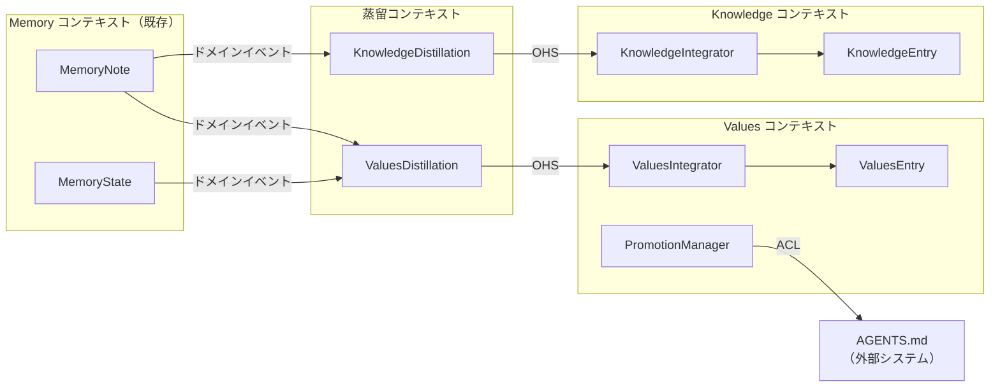
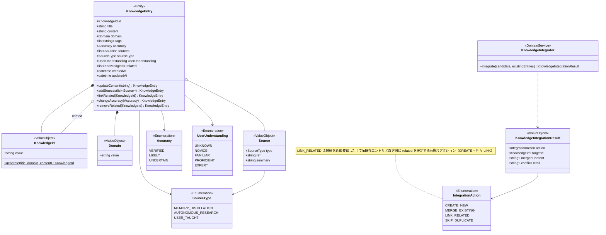
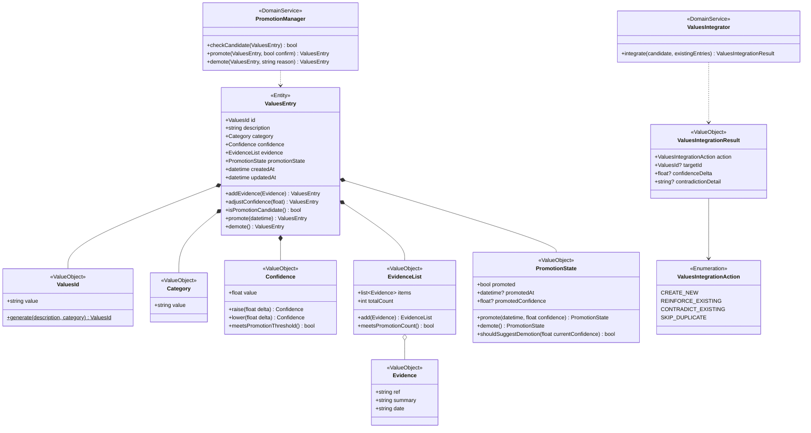
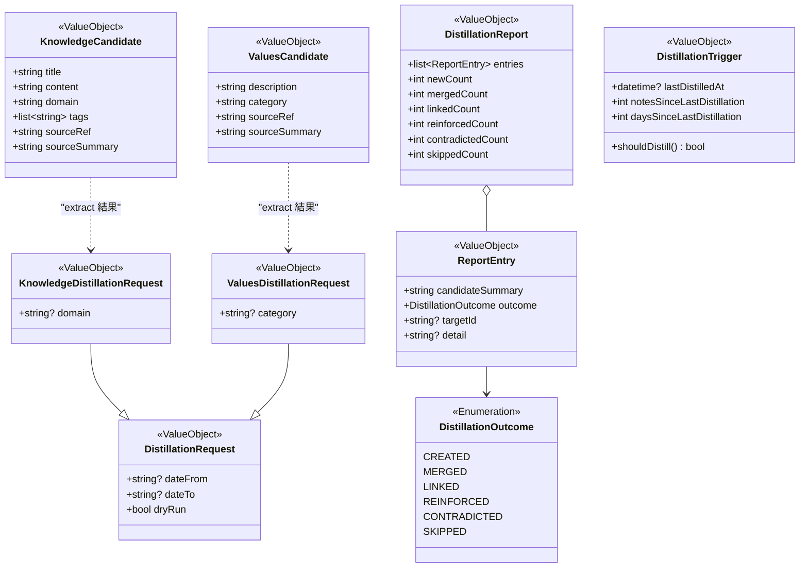
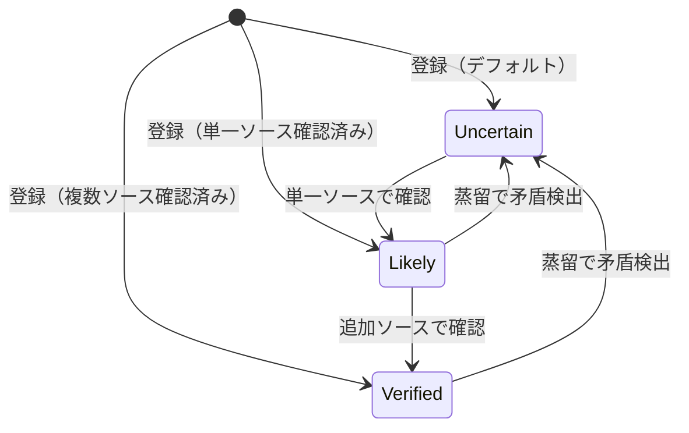
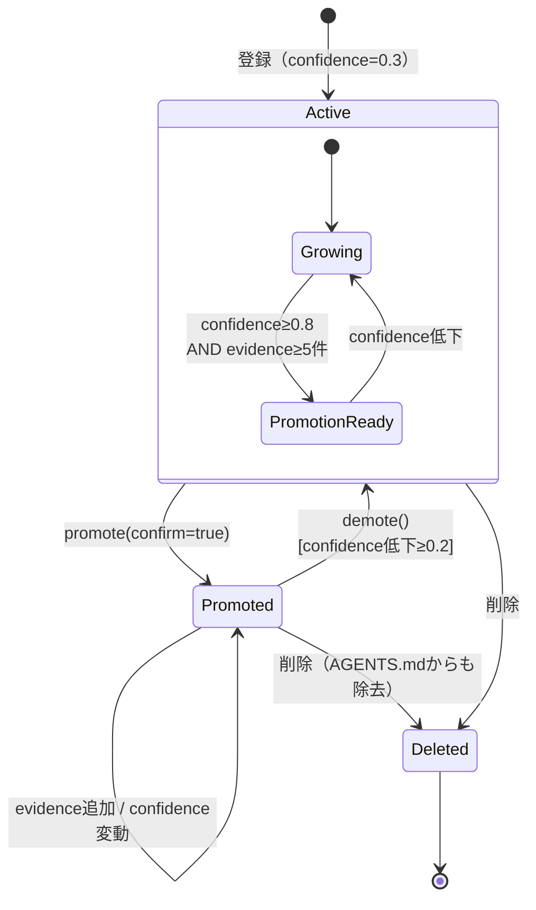

# ドメインモデル: Knowledge & Values 拡張

| 項目 | 内容 |
|---|---|
| バージョン | 0.1.0（ドラフト） |
| 最終更新日 | 2026-04-08 |
| 関連要件 | [REQ-knowledge-values.md](../requirements/REQ-knowledge-values.md) |

---

## 1. サブドメイン分類

| 分類 | サブドメイン | 理由 |
|---|---|---|
| **コアドメイン** | Knowledge 管理 / Values 管理 | 「使うほど良くなる」体験の差別化要因。モデリング投資を最大化すべき領域 |
| **支援ドメイン** | 蒸留エンジン | コアドメインの価値を引き出すが、抽出ロジック自体は LLM に委譲。オーケストレーションと統合判定がドメイン固有 |
| **汎用ドメイン** | ストレージ・検索基盤 | 既存の BM25+ エンジン・JSONL インデックス・Markdown ファイルストレージを流用 |

---

## 2. コンテキストマップ

**統合パターンの選択理由:**

| パターン | 適用箇所 | 理由 |
|---|---|---|
| ドメインイベント | Memory → 蒸留 | 蒸留は Memory の変更（ノート蓄積）をトリガーに実行される |
| 公開ホストサービス (OHS) | 蒸留 → Knowledge/Values | 蒸留結果を標準的な候補フォーマットで公開し、各コンテキストの Integrator が受け取る |
| 腐敗防止層 (ACL) | Values → AGENTS.md | AGENTS.md は Markdown テキスト形式の外部ファイルであり、Values ドメインモデルとの表現形式が異なる |

---

## 3. ドメインモデル図

### 3.1 Knowledge コンテキスト

**集約ルート**: `KnowledgeEntry`

**不変条件:**
- `id` は `title + domain + content[:100]` から決定論的に生成（プレフィックス `k-`）。ファイルパスは `knowledge/{domain}/{id}.md`（`id` 自体が `k-` を含む）。同一 ID の重複登録は不可（BR-1, BR-8）
- `sources` の更新はマージ（既存に追加。置換ではない）（BR-11）
- 削除時、他エントリの `related` からの参照除去はアプリケーション層の責務（BR-14、判断記録 2 参照）

### 3.2 Values コンテキスト

**集約ルート**: `ValuesEntry`

**不変条件:**
- `id` は `description + category` から決定論的に生成（プレフィックス `v-`）。ファイルパスは `values/{id}.md`（`id` 自体が `v-` を含む）（BR-2）
- `confidence` は 0.0〜1.0 の範囲。デフォルト 0.3（BR-4）
- `evidence` リストは最新10件を保持。超過分は `totalCount` のみインクリメント（BR-5）
- 昇格条件: `confidence >= 0.8` AND `evidence.totalCount >= 5` AND `promoted == false`（BR-6）
- 昇格にはユーザー確認（`confirm: true`）が必須（BR-7）
- 類似エントリの登録は警告付きで許可（エラーではない）（BR-9）
- `promoted: true` のエントリ削除時は AGENTS.md からも除去（BR-13）

### 3.3 蒸留コンテキスト

**補足:**
- 蒸留の「抽出」自体は LLM のエージェント処理。ツールはトリガーと結果の永続化を担う
- `DistillationTrigger` は蒸留種別（Knowledge / Values）ごとに個別にインスタンス化される。`lastDistilledAt` は `_state.md` に `last_knowledge_distilled_at` / `last_values_distilled_at` として種別ごとに永続化する
- `DistillationTrigger.shouldDistill()` の条件: 前回から10ノート以上 OR 7日以上経過 OR ユーザー明示要求（BR-12）

---

## 4. 状態遷移図

### 4.1 Knowledge — Accuracy 遷移

### 4.2 Values — ライフサイクル

**補足**: `PromotionReady` はエンティティに保存される状態ではなく、`Confidence.meetsPromotionThreshold()` AND `EvidenceList.meetsPromotionCount()` から導出される条件。`memory_values_update` のレスポンスで昇格候補として通知される。

---

## 5. 用語集

### 5.1 Memory コンテキスト（既存）

| 用語 | 定義 | 関連概念 |
|---|---|---|
| MemoryNote | セッション単位の具体的記録。`.md` ファイル | MemoryState |
| MemoryState | セッション横断の作業状態。`_state.md` | MemoryNote |

### 5.2 Knowledge コンテキスト

| 用語 | 定義 | 関連概念 |
|---|---|---|
| KnowledgeEntry | 抽象的な宣言的知識のエンティティ。事実・概念・ルールを含む | Source, Accuracy |
| KnowledgeId | `k-` プレフィックス付き決定論的識別子。`title + domain + content[:100]` から生成 | KnowledgeEntry |
| Domain | Knowledge の分類軸。自由入力の文字列 | KnowledgeEntry |
| Source | Knowledge の引用元。型（蒸留/リサーチ/教示）・参照先・要約で構成 | SourceType |
| Accuracy | Knowledge の品質指標。verified（複数ソース確認）/ likely（単一ソース）/ uncertain（未確認） | KnowledgeEntry |
| UserUnderstanding | ユーザーのその知識に対する理解度。unknown / novice / familiar / proficient / expert の5段階 | KnowledgeEntry |
| KnowledgeIntegrator | 蒸留候補と既存 Knowledge の重複検出・マージを行うドメインサービス | IntegrationAction |

### 5.3 Values コンテキスト

| 用語 | 定義 | 関連概念 |
|---|---|---|
| ValuesEntry | ユーザーの判断傾向・選好パターンのエンティティ | Evidence, Confidence |
| ValuesId | `v-` プレフィックス付き決定論的識別子。`description + category` から生成 | ValuesEntry |
| Category | Values の分類軸（coding-style, communication, workflow 等）。自由入力 | ValuesEntry |
| Confidence | 確信度（0.0〜1.0）。evidence 蓄積で上昇、矛盾で低下。デフォルト 0.3 | ValuesEntry |
| Evidence | Values の根拠事例。Memory ノートへの参照・要約・日付で構成 | ValuesEntry |
| EvidenceList | Evidence の管理コレクション。最新10件を保持し、総数を別途カウント | Evidence |
| PromotionState | 昇格状態。promoted フラグ・昇格日時・昇格時 confidence を保持 | ValuesEntry |
| PromotionManager | 昇格条件判定・昇格/降格実行を行うドメインサービス | PromotionState |
| ValuesIntegrator | 蒸留候補と既存 Values の重複検出・確信度更新を行うドメインサービス | Confidence |

### 5.4 蒸留コンテキスト

| 用語 | 定義 | 関連概念 |
|---|---|---|
| Distillation | Memory ノート群から Knowledge/Values を抽出するプロセス全体 | DistillationRequest |
| DistillationRequest | 蒸留のパラメータ（期間・フィルタ・dry_run） | KnowledgeCandidate, ValuesCandidate |
| KnowledgeCandidate | LLM が抽出した Knowledge の候補。title / content / domain / tags / sourceRef / sourceSummary を持つ統合前の中間表現 | DistillationReport |
| ValuesCandidate | LLM が抽出した Values の候補。description / category / sourceRef / sourceSummary を持つ統合前の中間表現 | DistillationReport |
| DistillationReport | 蒸留結果の報告。Knowledge 蒸留では新規・マージ・リンク・スキップ、Values 蒸留では新規・強化・矛盾・スキップの件数と詳細を保持する | DistillationOutcome |
| DistillationTrigger | 蒸留実行の推奨判定ロジック。ノート数閾値(10)・期間閾値(7日)で判定 | DistillationRequest |

---

## 6. 判断記録

### 判断記録 1: PromotionState に promotedConfidence を追加

- **日付**: 2026-04-08
- **関連コンテキスト**: Values コンテキスト
- **判断内容**: `PromotionState` 値オブジェクトに `promotedConfidence` フィールドを追加し、降格判定ロジックを `PromotionState` 自身に持たせる
- **根拠**:
  - 観測事実: REQ-FUNC-034 により、降格提案は「confidence が昇格時から 0.2 以上低下」で判定される。昇格時の confidence を保持しなければこの判定は不可能
  - 代替案: `PromotionManager` が外部から昇格時 confidence を取得する（例: 昇格履歴テーブル）
  - 分離証人: 代替案では昇格履歴という新たなストレージ概念が必要になり、`PromotionState` が自己完結できなくなる。`promotedConfidence` を `PromotionState` に含めれば、降格判定は Values 集約内で閉じる
- **等価性への影響**: 非等価（新フィールド追加により、降格判定という新たなビジネスルールの表現が可能になる）
- **語彙への影響**: なし

### 判断記録 2: Knowledge 削除時の related 一括更新をアプリケーション層の責務とする

- **日付**: 2026-04-08
- **関連コンテキスト**: Knowledge コンテキスト
- **判断内容**: Knowledge 削除時の `related` 逆引き・一括更新は、ドメインモデルではなくアプリケーションサービス（またはリポジトリ）の責務とする
- **根拠**:
  - 観測事実: `related` の逆引きは複数の `KnowledgeEntry` 集約をまたぐ操作であり、単一集約の不変条件ではない
  - 代替案: ドメインイベント `KnowledgeDeleted` を発行し、イベントハンドラで `related` を更新する
  - 分離証人: ドメインイベント方式はイベント基盤の導入コストが発生する。現在のファイルベースストレージではアプリケーション層での直接的な一括更新が最もシンプル。将来的にイベント基盤が導入された場合は移行可能
- **等価性への影響**: 理論等価（ビジネスルール BR-14 の実現手段の違いであり、結果は同じ）
- **語彙への影響**: なし

### 判断記録 3: shouldSuggestDemotion の配置

- **日付**: 2026-04-08
- **関連コンテキスト**: Values コンテキスト
- **判断内容**: 降格提案判定 `shouldSuggestDemotion()` を `PromotionManager` から `PromotionState` に移動する
- **根拠**:
  - 観測事実: 降格判定に必要な情報（`promotedConfidence`）は `PromotionState` が保持している。判定ロジックをデータと同じ場所に置くことで貧血モデルを回避できる
  - 代替案: `PromotionManager` に判定を残し、`PromotionState` から `promotedConfidence` を取得して計算する
  - 分離証人: 代替案では `PromotionManager` が `PromotionState` の内部知識（`promotedConfidence` の意味と閾値計算）に依存する。`PromotionState` に判定を持たせれば、閾値変更時の影響範囲が値オブジェクト内に閉じる
- **等価性への影響**: 理論等価（ロジック配置の変更であり、振る舞いは同一）
- **語彙への影響**: なし

---

## 7. ビジネスルール一覧

| # | ルール | 関連要件 |
|---|---|---|
| BR-1 | Knowledge ID は `title + domain + content[:100]` から決定論的に生成される（プレフィックス `k-`） | REQ-FUNC-001 |
| BR-2 | Values ID は `description + category` から決定論的に生成される（プレフィックス `v-`） | REQ-FUNC-002 |
| BR-3 | Knowledge の accuracy は `verified` / `likely` / `uncertain` の3段階 | REQ-FUNC-001 |
| BR-4 | Values の confidence は 0.0〜1.0 の範囲。デフォルト 0.3 | REQ-FUNC-002 |
| BR-5 | Values の evidence リストは最新10件を保持。超過分は evidence_count のみインクリメント | REQ-FUNC-002, 009 |
| BR-6 | 昇格条件: `confidence >= 0.8` AND `evidence_count >= 5` AND `promoted == false` | REQ-FUNC-015 |
| BR-7 | 昇格には `confirm: true`（ユーザー確認）が必須 | REQ-FUNC-016 |
| BR-8 | Knowledge 登録時、同一 ID が存在すればエラー（完全重複拒否） | REQ-FUNC-004 |
| BR-9 | Values 登録時、類似既存エントリがあれば警告（登録は許可） | REQ-FUNC-007 |
| BR-10 | 蒸留で抽出された Values が既存と同傾向なら confidence 上昇、矛盾なら confidence 低下 | REQ-FUNC-013 |
| BR-11 | Knowledge の sources 更新はマージ（置換ではなく追加） | REQ-FUNC-006 |
| BR-12 | 蒸留トリガー条件: 前回から10ノート以上 OR 7日以上経過 OR ユーザー明示要求 | REQ-FUNC-026 |
| BR-13 | `promoted: true` の Values を削除する場合、AGENTS.md からも該当行を削除する | REQ-FUNC-024 |
| BR-14 | Knowledge 削除時、他エントリの `related` からも参照を除去する | REQ-FUNC-023 |
| BR-15 | 降格提案条件: confidence が昇格時から 0.2 以上低下 | REQ-FUNC-034 |
