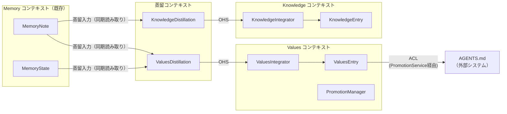
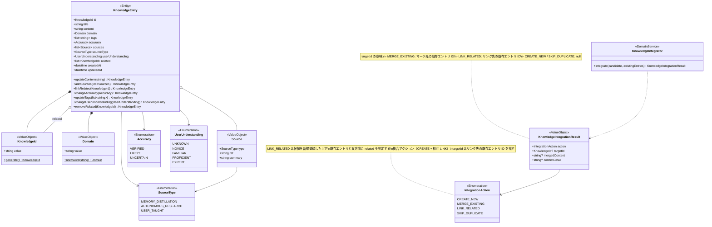
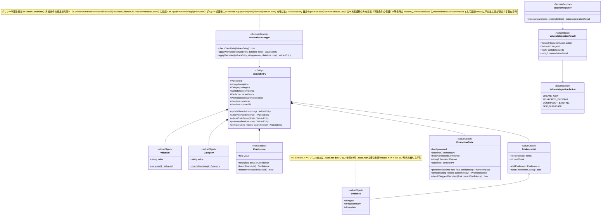
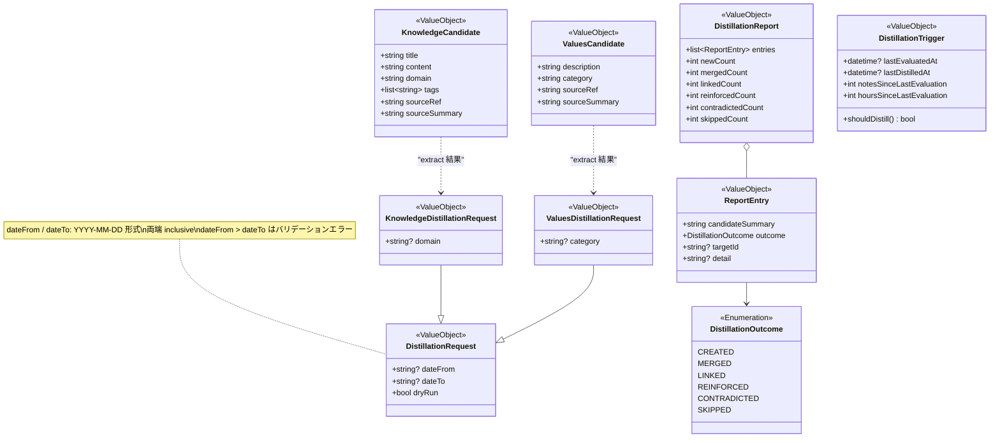
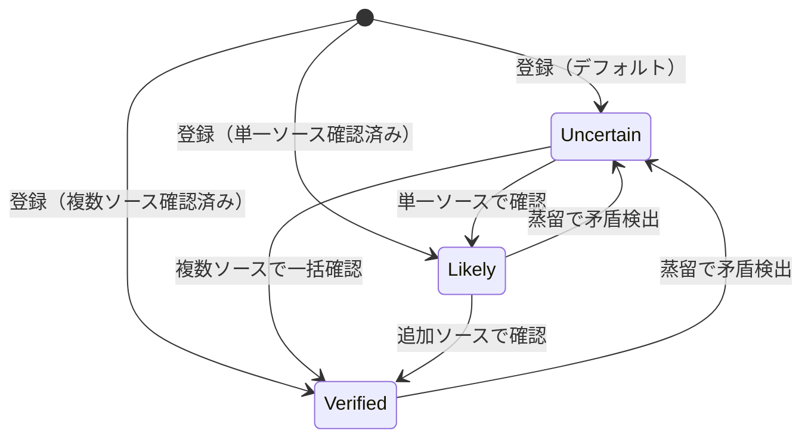
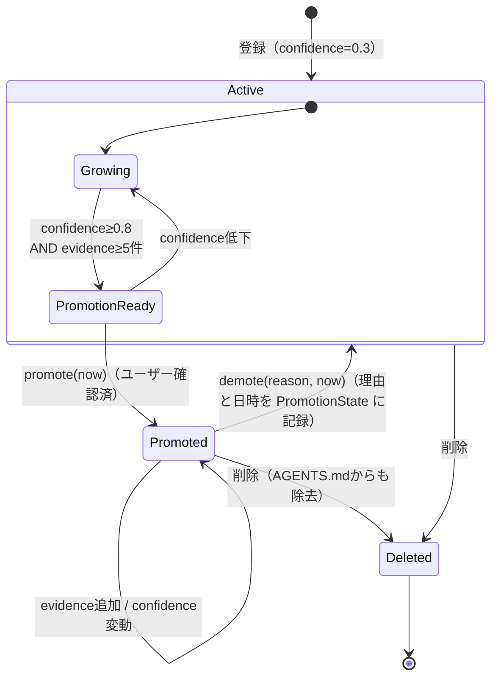

# ドメインモデル: Knowledge & Values 拡張

| 項目 | 内容 |
|---|---|
| バージョン | 0.1.0（ドラフト） |
| 最終更新日 | 2026-04-09 |
| 関連要件 | [REQ-knowledge-values.md](../requirements/REQ-knowledge-values.md) |

---

## 1. サブドメイン分類

| 分類 | サブドメイン | 理由 |
|---|---|---|
| **コアドメイン** | Knowledge 管理 / Values 管理 | 「使うほど良くなる」体験の差別化要因。モデリング投資を最大化すべき領域 |
| **支援ドメイン** | 蒸留エンジン | コアドメインの価値を引き出すが、抽出ロジック自体は LLM に委譲。オーケストレーションと統合判定がドメイン固有 |
| **汎用ドメイン** | ストレージ・検索基盤 | 既存の BM25+ エンジン・JSONL インデックス・Markdown ファイルストレージを流用 |

---

## 2. コンテキストマップ

**統合パターンの選択理由:**

| パターン | 適用箇所 | 理由 |
|---|---|---|
| 同期読み取り | MemoryNote → 蒸留（Knowledge / Values 共通） | 蒸留は `memory_distill_*` の同期呼び出しで実行され、MemoryNote を直接読み取る。概念的には Memory の蓄積が蒸留のトリガーだが、実装はイベント駆動ではなくポーリング型（トリガー条件の判定）である |
| 同期読み取り | MemoryState → Values 蒸留のみ | Values 蒸留は MemoryNote に加えて `_state.md` の「主要な判断」セクションも読み取る。Knowledge 蒸留は MemoryState を入力としない |
| 公開ホストサービス (OHS) | 蒸留 → Knowledge/Values | 蒸留結果を標準的な候補フォーマットで公開し、各コンテキストの Integrator が受け取る |
| 腐敗防止層 (ACL) | Values コンテキスト → AGENTS.md | AGENTS.md は Markdown テキスト形式の外部ファイルであり、Values ドメインモデルとの表現形式が異なる。ACL はアプリケーション層の `PromotionService` が `AgentsMdAdapter` を介して実現する（`PromotionManager` はドメインポリシー判定のみを担い、外部システムと直接通信しない） |

---

## 3. ドメインモデル図

### 3.1 Knowledge コンテキスト

**集約ルート**: `KnowledgeEntry`

**集約不変条件:**
- `id` は作成時に UUID を生成し `k-` プレフィックスを付与する immutable identifier。内容の変化に依存しない安定した識別子であり、更新で再計算しない。ファイルパスは `knowledge/{id}.md`。重複検出は `title` + `domain` + `content` の内容ベースで行い、同一内容の登録は不可（BR-1, BR-8）
- `sources` の更新はマージ（既存に追加。置換ではない）（BR-11）
- `sourceType` は作成時に一度だけ設定される immutable フィールド。`Source.type` とは独立にエントリレベルの出自分類を表す。MERGE_EXISTING（BR-11）時は既存エントリの `sourceType` を維持し、変更しない。新規 Source はそれぞれの `type` を持って `sources` リストに追加される

**アプリケーション層の運用制約:**
- 削除時、他エントリの `related` からの参照除去はアプリケーション層（`KnowledgeService`）の責務（BR-14、判断記録 2 参照）

### 3.2 Values コンテキスト

**集約ルート**: `ValuesEntry`

**集約不変条件:**
- `id` は作成時に UUID を生成し `v-` プレフィックスを付与する immutable identifier。内容の変化に依存しない安定した識別子であり、更新で再計算しない。ファイルパスは `values/{id}.md`。厳密重複検出は `description` + `category` の内容ベースで行い、同一内容の登録は不可（BR-2, BR-9）
- `confidence` は 0.0〜1.0 の範囲。デフォルト 0.3（BR-4）
- `evidence` リストは最新10件を保持。超過分は `totalCount` のみインクリメント（BR-5）。**作成時にも同じ 10 件保持ルールを適用する**。`totalCount` は提供された `evidence` の件数で初期化される（未提供時は 0）
- ID は異なるが意味的に類似するエントリの登録は警告付きで許可（エラーではない）（BR-9）

**ドメインサービスポリシー:**
- 昇格条件（BR-6: `confidence >= 0.8` AND `totalCount >= 5` AND `promoted == false`）は集約不変条件ではなく、`PromotionManager.checkCandidate()` が一元的に担うドメインサービスポリシーである。`Confidence.meetsPromotionThreshold()` と `EvidenceList.meetsPromotionCount()` に委譲して判定する

**アプリケーション層の運用制約:**
- 昇格にはユーザー確認が必須。`confirm` パラメータはアプリケーション層（`PromotionService`）で消費する（BR-7）
- `promoted: true` のエントリ削除時は AGENTS.md からも除去する。`ValuesService` が `PromotionService.onDelete(id)` に委譲（BR-13）

### 3.3 蒸留コンテキスト

**補足:**
- Values 蒸留は MemoryNote に加えて MemoryState（`_state.md`）の「主要な判断」セクションも入力とする。Knowledge 蒸留の入力は MemoryNote のみ
- 蒸留の「抽出」は `DistillationExtractorPort` 経由で LLM に委譲する。ツールは collect（ノート選定）→ extract（抽出委譲）→ integrate（統合・永続化）の全段階をオーケストレーションする
- `DistillationTrigger` は蒸留種別（Knowledge / Values）ごとに個別にインスタンス化される。`lastEvaluatedAt` は `_state.md` に `last_knowledge_evaluated_at` / `last_values_evaluated_at` として、`lastDistilledAt` は `last_knowledge_distilled_at` / `last_values_distilled_at` として種別ごとに永続化する
- **Bootstrap rule**: `lastEvaluatedAt` が null（初回蒸留前）の場合、ノートが 1 件以上存在すれば `shouldDistill()` は true を返す。これにより、蒸留未経験のワークスペースでも初回蒸留が推奨される
- **2つの起動経路と `shouldDistill()` の適用範囲**:
  - *公開 API ベースの推奨判定*: エージェント/スキルが `memory_state_show`（最終評価日時）と `memory_stats`（前回評価以降のノート蓄積数）を取得し、`DistillationTrigger.shouldDistill()` と同じ条件（BR-12）を評価する。条件充足時に蒸留を推奨する（自動実行ではない）。セッション終了時の振り返り（REQ-FUNC-021）と retrospective スキル（REQ-FUNC-029）がこの経路に該当する
  - *ユーザーの直接呼び出し* (`memory_distill_*`): `shouldDistill()` を**バイパス**して即座に蒸留パイプライン（collect → extract → integrate）を実行する。トリガー条件は評価しない
- **タイムスタンプの永続化と更新**: `_state.md` のフロントマターには蒸留種別ごとに 2 つの日時フィールドを記録する。各フィールドは `memory_init` 時には作成せず、更新条件を初めて満たした時点で独立に遅延追加する:
  - `lastEvaluatedAt`（最終評価日時）: `dry_run=false` の蒸留が完了した時点で追加または更新（永続化 0 件でも更新）。`DistillationTrigger.shouldDistill()` はこの日時を基準に判定する。初回 `dry_run=false` 蒸留完了時にフィールドが出現する
  - `lastDistilledAt`（最終永続化日時）: `dry_run=false` かつ 1 件以上の永続化（create / merge / link / reinforce）が発生した場合にのみ追加または更新。矛盾検出による `confidence` 低下（`CONTRADICT_EXISTING`）は永続化にカウントしない。永続化が発生しない蒸留では `lastEvaluatedAt` のみが存在し、`lastDistilledAt` は null のままとなりうる
  - `dry_run=true` の実行ではいずれも更新しない。起動経路による差異はない

---

## 4. 状態遷移図

### 4.1 Knowledge — Accuracy 遷移

**補足:** `Uncertain → Verified` の直接遷移は、複数の信頼できるソースが同時に追加された場合に発生する（例: ファクトチェックで複数の独立したソースを一括で確認した場合）。`changeAccuracy(Accuracy)` メソッドは任意の遷移を許可するが、呼び出し元（`KnowledgeService` / エージェント）がソース数に基づく適切な `accuracy` を選択する責務を負う。

### 4.2 Values — ライフサイクル

**補足:**
- `PromotionReady` はエンティティに保存される状態ではなく、`Confidence.meetsPromotionThreshold()` AND `EvidenceList.meetsPromotionCount()` から導出される条件。`memory_values_update` および `memory_values_add`（作成時に条件を満たす場合）のレスポンスで昇格候補として通知される。昇格遷移は `PromotionReady` サブステートからのみ発生する（`Growing` からの直接昇格は不可）
- **降格提案と降格実行の区別**: `demote(reason, now)` は理由と日時の指定を必要とするが、confidence 低下を前提条件としない。一方、BR-15 の「confidence が昇格時から 0.2 以上低下」は降格の**自動提案条件**（`PromotionState.shouldSuggestDemotion()`）であり、エージェントに降格を推奨するトリガーである。ユーザーは confidence 低下以外の理由（例: 明示的な撤回、方針変更）でも `memory_values_demote(id, reason)` を呼び出せる
- **昇格候補判定の責務配置**: 昇格候補の判定は `PromotionManager.checkCandidate()` が一元的に担い、`Confidence.meetsPromotionThreshold()` AND `EvidenceList.meetsPromotionCount()` AND `PromotionState.promoted == false` に委譲する。`ValuesEntry` 自身は昇格候補判定メソッドを持たない（判定ロジックの二重化を避けるため）

---

## 5. 用語集

### 5.1 Memory コンテキスト（既存）

| 用語 | 定義 | 関連概念 |
|---|---|---|
| MemoryNote | セッション単位の具体的記録。`.md` ファイル | MemoryState |
| MemoryState | セッション横断の作業状態。`_state.md` | MemoryNote |

### 5.2 Knowledge コンテキスト

| 用語 | 定義 | 関連概念 |
|---|---|---|
| KnowledgeEntry | 抽象的な宣言的知識のエンティティ。事実・概念・ルールを含む | Source, Accuracy |
| KnowledgeId | `k-` プレフィックス付き UUID ベースの識別子。作成時に一度だけ生成される immutable identifier。内容の変化に依存しない | KnowledgeEntry |
| Domain | Knowledge の分類軸。自由入力の文字列を kebab-case に正規化する | KnowledgeEntry |
| Source | Knowledge の引用元。型（`SourceType`）・参照先・要約で構成。MERGE_EXISTING 時、既存エントリの `sources` に追加される。追加された Source の `type` はエントリレベルの `sourceType` とは独立に管理される | SourceType |
| SourceType | Knowledge の出自分類。`MEMORY_DISTILLATION` / `AUTONOMOUS_RESEARCH` / `USER_TAUGHT` の3値。`KnowledgeEntry.sourceType`（エントリレベル）と `Source.type`（個別引用元レベル）の両方で使用される。`KnowledgeEntry.sourceType` は作成時に固定され、以降の更新で変更されない | KnowledgeEntry, Source |
| Accuracy | Knowledge の品質指標。verified（複数ソース確認）/ likely（単一ソース）/ uncertain（未確認） | KnowledgeEntry |
| UserUnderstanding | ユーザーのその知識に対する理解度。unknown / novice / familiar / proficient / expert の5段階 | KnowledgeEntry |
| KnowledgeIntegrator | 蒸留候補と既存 Knowledge の重複検出・マージを行うドメインサービス | IntegrationAction |

### 5.3 Values コンテキスト

| 用語 | 定義 | 関連概念 |
|---|---|---|
| ValuesEntry | ユーザーの判断傾向・選好パターンのエンティティ | Evidence, Confidence |
| ValuesId | `v-` プレフィックス付き UUID ベースの識別子。作成時に一度だけ生成される immutable identifier。内容の変化に依存しない | ValuesEntry |
| Category | Values の分類軸（coding-style, communication, workflow 等）。自由入力を kebab-case に正規化する | ValuesEntry |
| Confidence | 確信度（0.0〜1.0）。evidence 蓄積で上昇、矛盾で低下。デフォルト 0.3 | ValuesEntry |
| Evidence | Values の根拠事例。Memory ノートへの参照・要約・日付（`YYYY-MM-DD` 形式）で構成 | ValuesEntry |
| EvidenceList | Evidence の管理コレクション。最新10件を保持し、総数を `totalCount` で別途カウントする。永続化層（`_values.jsonl`）およびツール API では `evidence_count` として公開される | Evidence |
| PromotionState | 昇格状態。promoted フラグ・昇格日時・昇格時 confidence を保持し、降格提案判定（`shouldSuggestDemotion`）も自身で行う（判断記録 3）。降格時には `demotionReason`（降格理由）と `demotedAt`（降格日時）を記録する（判断記録 4） | ValuesEntry |
| PromotionManager | 昇格/降格のポリシー判定を行うドメインサービス。`checkCandidate()` で昇格条件を一元判定し（`Confidence.meetsPromotionThreshold()` AND `EvidenceList.meetsPromotionCount()` に委譲）、`applyPromotion(ValuesEntry, datetime now)` / `applyDemotion(entry, reason, now)` でポリシー検証後に `ValuesEntry` の状態遷移メソッドを呼び出す。降格提案判定は `PromotionState` に委譲。降格時の理由と日時は `PromotionState.demotionReason` / `demotedAt` に記録される | PromotionState |
| ValuesIntegrator | 蒸留候補と既存 Values の重複検出・確信度更新を行うドメインサービス | Confidence |

### 5.4 蒸留コンテキスト

| 用語 | 定義 | 関連概念 |
|---|---|---|
| Distillation | Memory ノート群から Knowledge/Values を抽出するプロセス全体。Values 蒸留では MemoryState（`_state.md`）の「主要な判断」セクションも入力とする | DistillationRequest |
| DistillationRequest | 蒸留のパラメータ（期間・フィルタ・dry_run） | KnowledgeCandidate, ValuesCandidate |
| KnowledgeCandidate | LLM が抽出した Knowledge の候補。title / content / domain / tags / sourceRef / sourceSummary を持つ統合前の中間表現 | DistillationReport |
| ValuesCandidate | LLM が抽出した Values の候補。description / category / sourceRef / sourceSummary を持つ統合前の中間表現 | DistillationReport |
| DistillationReport | 蒸留結果の報告。Knowledge 蒸留では新規・マージ・リンク・スキップ、Values 蒸留では新規・強化・矛盾・スキップの件数と詳細を保持する | DistillationOutcome |
| DistillationTrigger | 蒸留推奨の判定ロジック。最終評価日時（`lastEvaluatedAt`）を基準に、ノート数閾値(10)・期間閾値(168 時間)でタイムスタンプ精度の比較を行う（`lastEvaluatedAt` が null の場合はノート 1 件以上で true）。公開 API ベースの推奨判定（セッション終了時の振り返りと retrospective）で使用され、ユーザーの `memory_distill_*` 直接呼び出し時はバイパスされる | DistillationRequest |
| DistillationExtractorPort | 蒸留パイプラインにおける LLM 抽出処理のインフラ層ポート（インターフェース）。`DistillationService`（アプリケーション層）がこのポートを介して外部 LLM に抽出を委譲する。CLI / API / 将来の provider に差し替え可能な設計。想定実装先は `core/distillation/extractor.py`（提案。詳細はアーキテクチャ文書 4.2 参照） | DistillationRequest, KnowledgeCandidate, ValuesCandidate |

---

## 6. 判断記録

### 判断記録 1: PromotionState に promotedConfidence を追加

- **日付**: 2026-04-08
- **関連コンテキスト**: Values コンテキスト
- **判断内容**: `PromotionState` 値オブジェクトに `promotedConfidence` フィールドを追加し、降格判定ロジックを `PromotionState` 自身に持たせる
- **根拠**:
  - 観測事実: REQ-FUNC-034 により、降格提案は「confidence が昇格時から 0.2 以上低下」で判定される。昇格時の confidence を保持しなければこの判定は不可能
  - 代替案: `PromotionManager` が外部から昇格時 confidence を取得する（例: 昇格履歴テーブル）
  - 分離証人: 代替案では昇格履歴という新たなストレージ概念が必要になり、`PromotionState` が自己完結できなくなる。`promotedConfidence` を `PromotionState` に含めれば、降格判定は Values 集約内で閉じる
- **等価性への影響**: 非等価（新フィールド追加により、降格判定という新たなビジネスルールの表現が可能になる）
- **語彙への影響**: なし

### 判断記録 2: Knowledge 削除時の related 一括更新をアプリケーション層の責務とする

- **日付**: 2026-04-08
- **関連コンテキスト**: Knowledge コンテキスト
- **判断内容**: Knowledge 削除時の `related` 逆引き・一括更新は、ドメインモデルではなくアプリケーションサービス（またはリポジトリ）の責務とする
- **根拠**:
  - 観測事実: `related` の逆引きは複数の `KnowledgeEntry` 集約をまたぐ操作であり、単一集約の不変条件ではない
  - 代替案: ドメインイベント `KnowledgeDeleted` を発行し、イベントハンドラで `related` を更新する
  - 分離証人: ドメインイベント方式はイベント基盤の導入コストが発生する。現在のファイルベースストレージではアプリケーション層での直接的な一括更新が最もシンプル。将来的にイベント基盤が導入された場合は移行可能
- **等価性への影響**: 理論等価（ビジネスルール BR-14 の実現手段の違いであり、結果は同じ）
- **語彙への影響**: なし

### 判断記録 3: shouldSuggestDemotion の配置

- **日付**: 2026-04-08
- **関連コンテキスト**: Values コンテキスト
- **判断内容**: 降格提案判定 `shouldSuggestDemotion()` を `PromotionManager` から `PromotionState` に移動する
- **根拠**:
  - 観測事実: 降格判定に必要な情報（`promotedConfidence`）は `PromotionState` が保持している。判定ロジックをデータと同じ場所に置くことで貧血モデルを回避できる
  - 代替案: `PromotionManager` に判定を残し、`PromotionState` から `promotedConfidence` を取得して計算する
  - 分離証人: 代替案では `PromotionManager` が `PromotionState` の内部知識（`promotedConfidence` の意味と閾値計算）に依存する。`PromotionState` に判定を持たせれば、閾値変更時の影響範囲が値オブジェクト内に閉じる
- **等価性への影響**: 理論等価（ロジック配置の変更であり、振る舞いは同一）
- **語彙への影響**: なし

### 判断記録 4: PromotionState に降格理由と降格日時を記録する

- **日付**: 2026-04-09
- **関連コンテキスト**: Values コンテキスト
- **判断内容**: `PromotionState` に `demotionReason`（降格理由）と `demotedAt`（降格日時）フィールドを追加し、降格の監査証跡を `PromotionState` 内に閉じ込める
- **根拠**:
  - 観測事実（判断前）: `ValuesEntry.demote(reason)` および `PromotionManager.applyDemotion(entry, reason)` は降格理由を受け取るが、`PromotionState.demote()` が理由を保持せず、永続化時に理由が失われる。本判断により `PromotionState.demote(reason, now)` へ変更し、`now` を全シグネチャに伝播させた（クラス図参照）
  - 代替案 A: 降格履歴テーブル（別エンティティ）に理由を記録する
  - 代替案 B: `ValuesEntry` のトップレベルフィールドとして記録する
  - 分離証人: 代替案 A は新たなストレージ概念の導入コストが不要な段階では過剰。代替案 B は昇格/降格という関心事が `PromotionState` に凝集しているモデルと不整合。`PromotionState` に含めることで、昇格・降格のライフサイクル全体が値オブジェクト内で表現される
- **等価性への影響**: 非等価（新フィールド追加により、降格理由の監査が可能になる）
- **語彙への影響**: なし

---

## 7. ビジネスルール一覧

| # | ルール | 関連要件 |
|---|---|---|
| BR-1 | Knowledge ID は作成時に UUID を生成し `k-` プレフィックスを付与する immutable identifier。重複検出は `title` + `domain` + `content` の内容ベースで ID とは独立に行う | REQ-FUNC-001 |
| BR-2 | Values ID は作成時に UUID を生成し `v-` プレフィックスを付与する immutable identifier。厳密重複検出は `description` + `category` の内容ベースで ID とは独立に行う | REQ-FUNC-002 |
| BR-3 | Knowledge の accuracy は `verified` / `likely` / `uncertain` の3段階 | REQ-FUNC-001 |
| BR-4 | Values の confidence は 0.0〜1.0 の範囲。デフォルト 0.3 | REQ-FUNC-002 |
| BR-5 | Values の evidence リストは最新10件を保持。超過分は `totalCount`（永続化層では `evidence_count`）のみインクリメント | REQ-FUNC-002, REQ-FUNC-009 |
| BR-6 | 昇格条件: `confidence >= 0.8` AND `totalCount >= 5`（永続化層では `evidence_count >= 5`） AND `promoted == false` | REQ-FUNC-015 |
| BR-7 | 昇格にはユーザー確認が必須（`confirm` はアプリケーション層で消費） | REQ-FUNC-016 |
| BR-8 | Knowledge 登録時、`title` + `domain` + `content` が既存エントリと実質同一であればエラー（完全重複拒否。内容ベースで判定） | REQ-FUNC-004 |
| BR-9 | Values 登録時、`description` + `category` が既存エントリと実質同一であればエラー（厳密重複拒否。内容ベースで判定）。意味的に類似する既存エントリがあれば警告（登録は許可） | REQ-FUNC-007 |
| BR-10 | 蒸留で抽出された Values が既存と同傾向なら confidence 上昇、矛盾なら confidence 低下 | REQ-FUNC-013 |
| BR-11 | Knowledge の sources 更新はマージ（置換ではなく追加） | REQ-FUNC-006 |
| BR-12 | 蒸留トリガー条件（公開 API ベースの推奨判定のみに適用）: 前回評価（`lastEvaluatedAt`）から10ノート以上 OR 168 時間（7日相当）以上経過（タイムスタンプ精度で比較）。`lastEvaluatedAt` が null（初回蒸留前）の場合はノート 1 件以上で条件充足。ユーザーの `memory_distill_*` 直接呼び出しはトリガー判定をバイパスし即座に実行する | REQ-FUNC-026 |
| BR-13 | `promoted: true` の Values を削除する場合、AGENTS.md からも該当行を削除する | REQ-FUNC-024 |
| BR-14 | Knowledge 削除時、他エントリの `related` からも参照を除去する | REQ-FUNC-023 |
| BR-15 | 降格**提案**条件: confidence が昇格時から 0.2 以上低下（`PromotionState.shouldSuggestDemotion()` で判定）。降格**実行**は提案条件に限定されず、任意の理由（明示的撤回、方針変更等）で `memory_values_demote(id, reason)` を呼び出せる | REQ-FUNC-034 |
| BR-16 | Knowledge / Values の削除は Markdown ファイル（`knowledge/{id}.md` / `values/{id}.md`）と JSONL インデックスエントリ（`_knowledge.jsonl` / `_values.jsonl`）の両方を原子的に削除する。片方のみの削除は不整合を引き起こす | REQ-FUNC-023, REQ-FUNC-024 |
