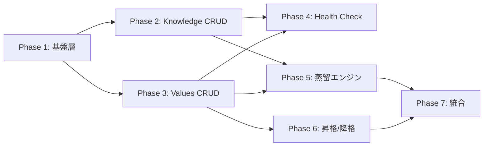

# 実装計画: Knowledge & Values 拡張

| 項目 | 内容 |
|---|---|
| 作成日 | 2026-04-10 |
| 対象要件 | [REQ-knowledge-values.md](../requirements/REQ-knowledge-values.md) |
| 対象設計 | [ARCHITECTURE-knowledge-values.md](../design/ARCHITECTURE-knowledge-values.md), [DOMAIN-MODEL-knowledge-values.md](../design/DOMAIN-MODEL-knowledge-values.md) |
| 親タスク | d1bec3e5-8b9c-4cd1-92d9-88ecd73241e2 |

---

## 1. 現状分析

### 1.1 実装ギャップ

| 区分 | 状態 |
|---|---|
| 設計文書（REQ/ARCH/DOMAIN） | レビュー済み・コミット済み（`fe3d9bd`, `dcd42b2`） |
| `core/knowledge/` | **未作成** |
| `core/values/` | **未作成** |
| `core/distillation/` | **未作成** |
| `core/security.py` | **未作成** |
| 新規 MCP ツール（15 本） | **未作成** |
| 既存モジュール拡張（6 本） | **未着手** |
| テスト | **未着手** |

### 1.2 既存コードベース概要

- `server.py`: 1,211 行、19 MCP ツール（`@mcp.tool` デコレータ）
- `core/`: フラットモジュール構成（`scorer.py`, `search.py`, `state.py`, `health.py`, `config.py`, `stats.py`, `index.py`, `note.py`, `query.py` 等）
- テスト: 16 ファイル、270+ テストケース（`pytest`）
- バージョン: v0.13.0

---

## 2. スコープ

### In Scope

ARCH §13 の Phase 1〜7 に対応する Must/Should 要件の実装。

| 優先度 | 件数 | 内訳 |
|---|---|---|
| Must | 22 | データモデル、CRUD、蒸留、昇格、AGENTS.md 改修 |
| Should | 7 | 削除、一括参照、トリガー、教示、同期、retrospective |

### Out of Scope

| 除外項目 | 理由 |
|---|---|
| Phase 8（Could 要件: REQ-FUNC-030〜033） | 初回リリースには不要。Phase 7 完了後に優先度を再評価する |
| REQ-FUNC-034（降格） | Could 優先度。ただし降格提案通知（`demotion_candidate`）は Must の REQ-FUNC-009 に含まれるため Phase 3 で実装する |
| Push 型配信 | スコープ外（REQ §1.5 明記） |

**注記**: REQ-FUNC-034（降格）は要件では Could だが、ARCH §5.5 で降格フローが設計済み。Phase 6（昇格）と同時に実装する方が `PromotionService` / `AgentsMdAdapter` の変更を一度にまとめられる。Phase 6 に含めることを推奨する。

---

## 3. フェーズ別タスク分解

### Phase 1: 基盤層（データモデル + ストレージ + 検索汎用化）

**対応要件**: REQ-FUNC-001, 002, 003, REQ-NF-001, REQ-NF-005

**依存**: なし

| # | タスク | 新規/変更ファイル | 受入基準 |
|---|---|---|---|
| 1-1 | `KnowledgeEntry` データモデル | `core/knowledge/__init__.py`, `core/knowledge/model.py` | dataclass 生成・シリアライズ/デシリアライズの往復テスト。不変条件（ID 生成 `k-` prefix、accuracy enum バリデーション、sources マージ）のテスト |
| 1-2 | `ValuesEntry` データモデル | `core/values/__init__.py`, `core/values/model.py` | dataclass 生成・シリアライズ/デシリアライズの往復テスト。不変条件（ID 生成 `v-` prefix、confidence 0.0〜1.0 範囲、evidence 10件上限、PromotionState 遷移）のテスト |
| 1-3 | `KnowledgeRepository` | `core/knowledge/repository.py` | `knowledge/{id}.md` ファイル + `_knowledge.jsonl` エントリの save/load/delete 往復。orphan 検出可能 |
| 1-4 | `ValuesRepository` | `core/values/repository.py` | `values/{id}.md` ファイル + `_values.jsonl` エントリの save/load/delete 往復。orphan 検出可能 |
| 1-5 | `memory_init` 拡張 | `core/config.py` | `memory_init` 実行で `knowledge/` + `values/` ディレクトリが冪等に作成される。AGENTS.md に `BEGIN/END:PROMOTED_VALUES` マーカーが冪等に挿入される。既存テスト全件パス |
| 1-6 | 検索エンジン汎用化 | `core/scorer.py`, `core/search.py` | `score_generic_entry` が任意のフィールドマッピングで BM25+ スコアを算出。既存 `score_entry` のテスト全件パス |
| 1-7 | `SecretScanPolicy` | `core/security.py` | 正規表現ベースでシークレット（AWS キー、API トークン、GitHub PAT 等）を検出。検出/非検出のテスト |
| 1-8 | 「実質同一」ユーティリティ | `core/knowledge/model.py` or 共通ユーティリティ | NFC 正規化 → trim → 空白圧縮 → case-sensitive 一致の判定関数。テスト |

**テストファイル**: `tests/test_knowledge_model.py`, `tests/test_values_model.py`, `tests/test_knowledge_repository.py`, `tests/test_values_repository.py`, `tests/test_scorer_generic.py`, `tests/test_security.py`

**検証**:
- `uv run pytest tests/ --cov=agentic_memory` で既存 270+ テストが全件パス
- 新規テストが上記受入基準を全て検証

---

### Phase 2: Knowledge CRUD

**対応要件**: REQ-FUNC-004, 005, 006

**依存**: Phase 1

| # | タスク | 新規/変更ファイル | 受入基準 |
|---|---|---|---|
| 2-1 | `KnowledgeService` | `core/knowledge/service.py` | add/search/update のオーケストレーション。重複チェック（`title + domain + content` 実質同一）。related 逆引き更新 |
| 2-2 | `memory_knowledge_add` MCP ツール | `server.py` | 有効パラメータで `.md` + `_knowledge.jsonl` 作成。重複時エラー。機密検出で warning |
| 2-3 | `memory_knowledge_search` MCP ツール | `server.py` | `query` + `domain` フィルタ。BM25+ ランキング。`domain` のみ時 `updated_at` 降順 |
| 2-4 | `memory_knowledge_update` MCP ツール | `server.py` | 属性部分更新。`sources` マージ。更新後の重複チェック。存在しない ID でエラー |

**テストファイル**: `tests/test_knowledge_service.py`, `tests/test_knowledge_tools.py`

**検証**:
- 統合テスト: `memory_knowledge_add` → `memory_knowledge_search` → `memory_knowledge_update` の一連フロー
- 重複検出・バリデーションエラーの異常系テスト

---

### Phase 3: Values CRUD + 一括参照

**対応要件**: REQ-FUNC-007, 008, 009, 025

**依存**: Phase 1（Phase 2 と並行実装可能）

| # | タスク | 新規/変更ファイル | 受入基準 |
|---|---|---|---|
| 3-1 | `ValuesService` | `core/values/service.py` | add/search/update/list のオーケストレーション。重複チェック（`description + category` 実質同一）。類似判定（BM25+ max-normalization ≥ 0.7）。昇格候補通知。降格提案通知 |
| 3-2 | `memory_values_add` MCP ツール | `server.py` | 有効パラメータで `.md` + `_values.jsonl` 作成。重複時エラー。類似時 warning。昇格候補判定 |
| 3-3 | `memory_values_search` MCP ツール | `server.py` | `query` + `category` + `min_confidence` フィルタ。BM25+ ランキング。`category` のみ時 `confidence` 降順 |
| 3-4 | `memory_values_update` MCP ツール | `server.py` | confidence/evidence/description 更新。evidence 10件上限。promotion_candidate/demotion_candidate 通知 |
| 3-5 | `memory_values_list` MCP ツール | `server.py` | `min_confidence` / `category` / `promoted_only` フィルタ。`confidence` 降順ソート。`top` 制限 |

**テストファイル**: `tests/test_values_service.py`, `tests/test_values_tools.py`

**検証**:
- 類似判定の閾値テスト（0.7 前後のスコアで境界確認）
- 昇格候補通知（confidence ≥ 0.8 AND evidence_count ≥ 5 AND promoted == false）の条件テスト
- evidence 上限（10件保持、先頭追加・末尾除去）のテスト

---

### Phase 4: Health Check 拡張

**対応要件**: REQ-NF-004

**依存**: Phase 2, Phase 3

| # | タスク | 新規/変更ファイル | 受入基準 |
|---|---|---|---|
| 4-1 | K/V インデックス整合性チェック | `core/health.py` | orphan インデックスエントリ・orphan ファイル検出。lazy 生成パターンの正常判定 |
| 4-2 | Knowledge `related` リンク整合性チェック | `core/health.py` | orphan link・片方向リンク検出。`fix=true` で修復 |
| 4-3 | K/V orphan 自動修復 | `core/health.py` | `fix=true` で orphan エントリ除去・未登録ファイル再インデックス |

**テストファイル**: `tests/test_health.py`（既存ファイルに追加）

**検証**:
- 各種不整合状態を人為的に作成し、検出・修復を確認
- lazy 生成パターン 4 状態の判定テスト

---

### Phase 5: 蒸留エンジン

**対応要件**: REQ-FUNC-010, 011, 012, 013

**依存**: Phase 2, Phase 3

| # | タスク | 新規/変更ファイル | 受入基準 |
|---|---|---|---|
| 5-1 | `DistillationExtractorPort` | `core/distillation/__init__.py`, `core/distillation/extractor.py` | ポートインターフェース定義。テスト用モック実装 |
| 5-2 | `KnowledgeIntegrator` | `core/knowledge/integrator.py` | 4 アクション（CREATE_NEW / MERGE_EXISTING / LINK_RELATED / SKIP_DUPLICATE）の判定テスト |
| 5-3 | `ValuesIntegrator` | `core/values/integrator.py` | 4 アクション（CREATE_NEW / REINFORCE_EXISTING / CONTRADICT_EXISTING / SKIP_DUPLICATE）の判定テスト |
| 5-4 | `DistillationService` | `core/distillation/service.py` | collect → extract → integrate の 3 段パイプライン。dry_run/非 dry_run。日付フィルタ。`_state.md` 入力（Values） |
| 5-5 | `DistillationTrigger` | `core/distillation/trigger.py` | 条件定義（10 ノート OR 168h）。Bootstrap rule。`shouldDistill()` テスト |
| 5-6 | `memory_distill_knowledge` MCP ツール | `server.py` | パイプライン実行。DistillationReport 返却。secret_skipped_count。`_state.md` 蒸留日時更新 |
| 5-7 | `memory_distill_values` MCP ツール | `server.py` | パイプライン実行。`_state.md` 「主要な判断」セクション入力。Evidence.date 導出 |
| 5-8 | `_state.md` フロントマター読み書き | `core/state.py` | 4 フィールド（`last_*_distilled_at`, `last_*_evaluated_at`）の遅延追加・読み書き |

**テストファイル**: `tests/test_distillation.py`, `tests/test_knowledge_integrator.py`, `tests/test_values_integrator.py`

**検証**:
- モック ExtractorPort を使ったパイプライン統合テスト
- dry_run=true で永続化なし・dry_run=false で永続化ありの確認
- `_state.md` フロントマターの蒸留日時更新テスト
- 機密候補のスキップと `secret_skipped_count` テスト

---

### Phase 6: Values 昇格 + AGENTS.md 連携 + 降格

**対応要件**: REQ-FUNC-015, 016, 022, 034

**依存**: Phase 3

| # | タスク | 新規/変更ファイル | 受入基準 |
|---|---|---|---|
| 6-1 | `PromotionManager` | `core/values/promotion.py` | 昇格条件判定（confidence ≥ 0.8 AND evidence_count ≥ 5 AND promoted == false）。降格ポリシー |
| 6-2 | `AgentsMdAdapter` | `core/values/agents_md.py` | `appendEntry` / `removeEntry` / `listEntries` / `syncCheck` / `writeAtomically`。fcntl ロック + atomic write。マーカー検証 |
| 6-3 | `PromotionService` | `core/values/promotion.py` | 昇格/降格ワークフロー。confirm ガードレール。`onDelete` メソッド |
| 6-4 | `memory_values_promote` MCP ツール | `server.py` | confirm=true 必須。昇格条件チェック。AGENTS.md 書き込み。promoted 状態更新 |
| 6-5 | `memory_values_demote` MCP ツール | `server.py` | promoted=true 検証。AGENTS.md 除去。demotion_reason/demoted_at 記録 |

**テストファイル**: `tests/test_promotion.py`, `tests/test_agents_md.py`

**検証**:
- 昇格条件充足/未充足のテスト
- AGENTS.md マーカー内への書き込み・削除テスト
- confirm ガードレール（false → エラー）テスト
- 再昇格拒否テスト
- 降格 → AGENTS.md 除去 → promoted=false 更新テスト
- 部分失敗検出テスト

---

### Phase 7: 統合・削除・トリガー・AGENTS.md 改修

**対応要件**: REQ-FUNC-014, 019-021（Must）, 023-024, 026-029（Should）

**依存**: Phase 5, Phase 6

| # | タスク | 新規/変更ファイル | 受入基準 |
|---|---|---|---|
| 7-1 | `memory_knowledge_delete` MCP ツール | `server.py` | ファイル + インデックス削除。related 逆引き除去 |
| 7-2 | `memory_values_delete` MCP ツール | `server.py` | ファイル + インデックス削除。promoted 時は confirm + AGENTS.md 除去。プレビュー |
| 7-3 | Health check: promoted 同期チェック | `core/health.py` | `syncCheck()` 双方向チェック。`fix=true` で修復 |
| 7-4 | 蒸留トリガー判定データ公開 | `core/state.py`, `core/stats.py`, `server.py` | `memory_state_show` に `frontmatter` 追加。`memory_stats` に `notes_since_last_*_evaluation` 追加。Bootstrap 契約 |
| 7-5 | AGENTS.md 記憶管理セクション改修 | AGENTS.md（外部） | 3 層構造・ツール一覧・セッション開始/終了手順の記載 |
| 7-6 | retrospective スキル拡張 | スキル定義ファイル（外部） | 蒸留推奨判断の組み込み |

**テストファイル**: `tests/test_knowledge_tools.py`（追加）, `tests/test_values_tools.py`（追加）, `tests/test_health.py`（追加）, `tests/test_state.py`（追加）, `tests/test_stats.py`（追加）

**検証**:
- promoted Values 削除の confirm ガードレール + プレビューテスト
- `memory_state_show` の frontmatter フィールド存在テスト
- `memory_stats` の notes_since カウントテスト（Bootstrap 時 = 全ノート数）
- 既存テスト全件リグレッションパス

---

## 4. 新規ファイル一覧（推定 ~35 ファイル）

### プロダクションコード（~18 ファイル）

```
src/agentic_memory/core/
├── knowledge/
│   ├── __init__.py              # 公開 API re-export
│   ├── model.py                 # KnowledgeEntry, KnowledgeId, Source, Domain, Accuracy, etc.
│   ├── service.py               # KnowledgeService
│   ├── repository.py            # KnowledgeRepository
│   └── integrator.py            # KnowledgeIntegrator
├── values/
│   ├── __init__.py              # 公開 API re-export
│   ├── model.py                 # ValuesEntry, ValuesId, Category, Confidence, Evidence, etc.
│   ├── service.py               # ValuesService
│   ├── repository.py            # ValuesRepository
│   ├── integrator.py            # ValuesIntegrator
│   ├── promotion.py             # PromotionService, PromotionManager
│   └── agents_md.py             # AgentsMdAdapter
├── distillation/
│   ├── __init__.py              # 公開 API re-export
│   ├── service.py               # DistillationService
│   ├── extractor.py             # DistillationExtractorPort (ABC + mock)
│   └── trigger.py               # DistillationTrigger
└── security.py                  # SecretScanPolicy
```

### 変更する既存ファイル（6 ファイル）

| ファイル | 変更概要 |
|---|---|
| `server.py` | 15 新規 MCP ツール関数追加 |
| `core/config.py` | `init_memory_dir()` に `knowledge/` / `values/` ディレクトリ + AGENTS.md マーカー作成追加 |
| `core/scorer.py` | `score_generic_entry()` 追加（既存 `score_entry` 不変） |
| `core/search.py` | 汎用検索関数追加（既存関数不変） |
| `core/state.py` | `_state.md` YAML フロントマター読み書き追加 |
| `core/health.py` | K/V インデックス整合性 + related リンク + promoted 同期チェック追加 |
| `core/stats.py` | `notes_since_last_*_evaluation` フィールド追加 |

### テストファイル（~10 ファイル）

```
tests/
├── test_knowledge_model.py
├── test_knowledge_repository.py
├── test_knowledge_service.py
├── test_knowledge_tools.py
├── test_values_model.py
├── test_values_repository.py
├── test_values_service.py
├── test_values_tools.py
├── test_distillation.py
├── test_knowledge_integrator.py
├── test_values_integrator.py
├── test_promotion.py
├── test_agents_md.py
└── test_security.py
```

---

## 5. 新規 MCP ツール一覧（15 本）

| # | ツール名 | Phase | 対応要件 | アノテーション |
|---|---|---|---|---|
| 1 | `memory_knowledge_add` | 2 | REQ-FUNC-004 | ADDITIVE |
| 2 | `memory_knowledge_search` | 2 | REQ-FUNC-005 | READONLY |
| 3 | `memory_knowledge_update` | 2 | REQ-FUNC-006 | IDEMPOTENT |
| 4 | `memory_values_add` | 3 | REQ-FUNC-007 | ADDITIVE |
| 5 | `memory_values_search` | 3 | REQ-FUNC-008 | READONLY |
| 6 | `memory_values_update` | 3 | REQ-FUNC-009 | IDEMPOTENT |
| 7 | `memory_values_list` | 3 | REQ-FUNC-025 | READONLY |
| 8 | `memory_distill_knowledge` | 5 | REQ-FUNC-010 | ADDITIVE |
| 9 | `memory_distill_values` | 5 | REQ-FUNC-011 | ADDITIVE |
| 10 | `memory_values_promote` | 6 | REQ-FUNC-016 | DESTRUCTIVE |
| 11 | `memory_values_demote` | 6 | REQ-FUNC-034 | DESTRUCTIVE |
| 12 | `memory_knowledge_delete` | 7 | REQ-FUNC-023 | DESTRUCTIVE |
| 13 | `memory_values_delete` | 7 | REQ-FUNC-024 | DESTRUCTIVE |

**既存ツール拡張（2 本）**:

| ツール名 | Phase | 対応要件 | 変更内容 |
|---|---|---|---|
| `memory_state_show` | 7 | REQ-FUNC-026 | `frontmatter` フィールド追加 |
| `memory_stats` | 7 | REQ-FUNC-026 | `notes_since_last_*_evaluation` フィールド追加 |

---

## 6. 実行戦略

### 並行実行可能グループ



- **Phase 2 と Phase 3 は並行実装可能**（相互独立。Phase 1 のみに依存）
- **Phase 4 と Phase 5 は並行実装可能**（Phase 4 は Phase 2,3 に依存。Phase 5 も Phase 2,3 に依存。両者間に依存なし）
- **Phase 6 は Phase 3 のみに依存**（Phase 5 と並行可能）

### クリティカルパス

`Phase 1 → Phase 3 → Phase 6 → Phase 7`（Values の昇格/降格が Phase 7 の promoted 同期チェック・削除フローのブロッカー）

### 推奨ロール割り当て

| Phase | 推奨ロール | 理由 |
|---|---|---|
| Phase 1 | `implementer` | データモデル + リポジトリ + 既存拡張。設計判断は ARCH に確定済み |
| Phase 2 | `implementer` | Knowledge CRUD。Phase 1 パターンの横展開 |
| Phase 3 | `implementer` | Values CRUD。Phase 1 パターンの横展開 + 類似判定ロジック |
| Phase 4 | `implementer` | health.py への追加。既存パターン踏襲 |
| Phase 5 | `implementer` | 蒸留エンジン。ExtractorPort のインターフェース設計含む |
| Phase 6 | `implementer` | 昇格/降格 + AGENTS.md 連携。セキュリティ考慮（confirm ガードレール、atomic write） |
| Phase 7 | `implementer` | 統合・削除・トリガー。既存ツール拡張含む |

**全 Phase 共通**: 各 Phase 完了時に `code-reviewer` で独立レビューを実施する。

---

## 7. 検証戦略

### 7.1 各 Phase のゲート条件

| Phase | テスト要件 | リグレッション |
|---|---|---|
| Phase 1 | モデルの往復テスト、リポジトリの CRUD テスト、`score_generic_entry` テスト | 既存 270+ テスト全件パス |
| Phase 2 | Knowledge CRUD 統合テスト（正常系 + 異常系） | 同上 |
| Phase 3 | Values CRUD 統合テスト + 類似判定境界テスト | 同上 |
| Phase 4 | health check 不整合検出 + fix 修復テスト | 同上 |
| Phase 5 | モック ExtractorPort での蒸留パイプラインテスト | 同上 |
| Phase 6 | 昇格/降格 + AGENTS.md 操作テスト | 同上 |
| Phase 7 | 削除 + promoted 同期 + frontmatter + notes_since テスト | 同上 |

### 7.2 E2E 検証シナリオ（Phase 7 完了後）

1. **Knowledge ライフサイクル**: `memory_init` → `memory_knowledge_add` × 3 → `memory_knowledge_search` → `memory_knowledge_update` → `memory_knowledge_delete` → `memory_health_check`
2. **Values ライフサイクル**: `memory_values_add` × 5（evidence 付き、confidence ≥ 0.8）→ `memory_values_search` → `memory_values_update`（evidence 追加）→ `memory_values_list` → `memory_values_promote` → `memory_values_demote` → `memory_values_delete`
3. **蒸留パイプライン**: Memory ノート 10+ 件作成 → `memory_distill_knowledge(dry_run=true)` → `memory_distill_knowledge(dry_run=false)` → `memory_distill_values(dry_run=false)` → `memory_state_show`（frontmatter 確認）→ `memory_stats`（notes_since 確認）
4. **部分失敗回復**: promoted Values の AGENTS.md 行を手動削除 → `memory_health_check` で検出 → `memory_health_check(fix=true)` で修復

### 7.3 性能検証

| 要件 | テスト方法 |
|---|---|
| REQ-NF-001（検索 p95 ≤ 500ms） | 1,000 件の Knowledge/Values インデックスを生成し、CI ランナーで `memory_knowledge_search` / `memory_values_search` の p95 を計測 |
| REQ-NF-002（蒸留 collect+integrate ≤ 5s/100 notes） | 100 ノートの蒸留パイプライン（モック ExtractorPort）で collect + integrate の経過時間を計測 |

---

## 8. リスクと軽減策

| リスク | 影響度 | 軽減策 |
|---|---|---|
| `DistillationExtractorPort` の LLM 依存 | 中 | テストではモック実装を使用。初回リリースでは `NotImplementedError` を返すデフォルト実装でも機能する（CRUD/検索/昇格は独立動作） |
| `server.py` の肥大化（1,211 行 + 15 ツール） | 低 | ツール関数は薄いラッパー（パラメータ変換 + Service 呼び出し + レスポンス整形）に限定。ロジックは Service 層に集中 |
| AGENTS.md 操作の安全性 | 高 | confirm ガードレール + fcntl ロック + atomic write + health check 同期チェック。テストでマーカー欠落・部分失敗を網羅 |
| 既存テストの破壊 | 高 | 既存モジュールは Open-Closed（追加のみ）。各 Phase で全既存テストを CI 実行 |

---

## 9. 妥当性判定

- [x] 全 In Scope 要件（Must 22 + Should 7）にタスクが対応している
- [x] 全リーフタスクに検証可能な受入基準が設定されている
- [x] 依存関係に循環がない
- [x] クリティカルパスが明示されている（Phase 1 → 3 → 6 → 7）
- [x] 並行実行可能グループが特定されている（Phase 2/3、Phase 4/5/6）
- [x] 優先順位の根拠が記録されている（Must 先行、Phase 間の技術的依存）

**判定: 承認**
